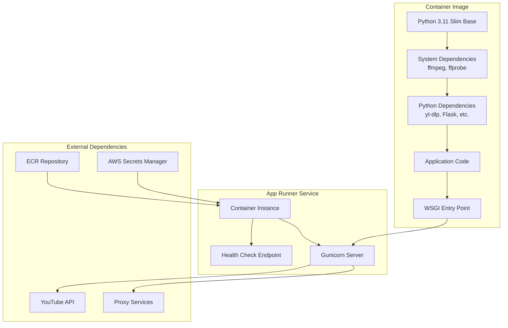

# Design Document

## Overview

This design outlines the migration from source-based App Runner deployment to container-based deployment for the TL;DW application. The solution addresses reliability issues with ffmpeg availability, improves Gunicorn configuration, and provides development flexibility through dependency override mechanisms.

The current application already has partial container support but needs refinement for production deployment. The migration will ensure consistent runtime environments and better control over system dependencies.

## Architecture

### Current State Analysis

The application currently has:
- A Dockerfile with ffmpeg installation and dependency verification
- A wsgi.py with basic dependency checking that exits on missing dependencies
- An apprunner.container.yaml configured for source-based deployment
- Flask app (app.py) with comprehensive health checks and dependency verification

### Target Architecture



## Components and Interfaces

### 1. Dockerfile Optimization

**Current Issues:**
- Complex dependency verification during build
- Missing environment variable optimization
- Verbose logging during build

**Design Solution:**
- Streamlined Dockerfile with minimal, proven configuration
- Environment variables for Python optimization
- Simplified dependency verification
- Proper layer caching for faster builds

**Interface:**
```dockerfile
FROM python:3.11-slim
ENV PYTHONDONTWRITEBYTECODE=1 \
    PYTHONUNBUFFERED=1 \
    PORT=8080
# System and Python dependencies
# Application code
# Gunicorn entrypoint
```

### 2. Enhanced WSGI Entry Point

**Current Issues:**
- Hard failure on missing dependencies prevents development
- No explicit ffmpeg path export for yt-dlp
- Limited flexibility for different environments

**Design Solution:**
- Environment-based dependency override (`ALLOW_MISSING_DEPS`)
- Explicit ffmpeg location export (`FFMPEG_LOCATION`)
- Structured logging with clear startup phases
- Graceful degradation for development environments

**Interface:**
```python
def _check_binary(name: str) -> Optional[str]:
    # Returns path or None with appropriate logging
    
def log_startup_dependencies() -> None:
    # Comprehensive dependency verification with override support
    
# Environment variables set:
# - FFMPEG_LOCATION=/usr/bin (when ffmpeg available)
```

### 3. Application Entry Point Alignment

**Current State:**
- main.py imports from app.py
- wsgi.py imports from app.py
- Potential import path confusion

**Design Solution:**
- Ensure wsgi.py exposes `app` object correctly
- Maintain compatibility with existing main.py
- Clear import hierarchy

### 4. yt-dlp Integration Enhancement

**Current Implementation:**
- yt-dlp calls in transcript_service.py
- User agent management integration
- Proxy configuration support

**Design Enhancement:**
- Explicit `--ffmpeg-location` parameter usage
- Consistent proxy and user agent configuration
- Socket timeout configuration for reliability

**Interface:**
```python
ydl_opts = {
    'ffmpeg_location': os.environ.get('FFMPEG_LOCATION', '/usr/bin'),
    'user_agent': user_agent,
    'proxy': proxy_url,
    'socket_timeout': 15
}
```

### 5. Deployment Configuration

**Migration Strategy:**
- Remove/rename apprunner.yaml to prevent source-based deployment
- Configure App Runner for image-based deployment
- ECR repository setup and image management
- Health check endpoint configuration

## Data Models

### Dependency Status Model
```python
@dataclass
class DependencyStatus:
    name: str
    available: bool
    path: Optional[str] = None
    version: Optional[str] = None
    error: Optional[str] = None
```

### Startup Configuration Model
```python
@dataclass
class StartupConfig:
    allow_missing_deps: bool
    ffmpeg_location: Optional[str]
    log_level: str
    environment: str  # dev, staging, production
```

## Error Handling

### Dependency Missing Scenarios

1. **Production Environment (ALLOW_MISSING_DEPS=false)**
   - Log error and exit with status code 1
   - Prevent container startup
   - Clear error messages for debugging

2. **Development Environment (ALLOW_MISSING_DEPS=true)**
   - Log warning and continue
   - Set degraded health status
   - Allow application to start for development

### yt-dlp Execution Errors

1. **ffmpeg Not Found**
   - Use explicit `--ffmpeg-location` parameter
   - Fallback to system PATH if location fails
   - Clear error logging for troubleshooting

2. **Proxy Connection Issues**
   - Retry with different proxy endpoints
   - Fallback to direct connection if configured
   - Session rotation for bot-check scenarios

### Container Build Failures

1. **System Dependency Installation**
   - Fail fast during apt-get operations
   - Clear error messages for missing packages
   - Proper cleanup of package cache

2. **Python Dependency Installation**
   - Use --no-cache-dir for consistent builds
   - Explicit version pinning in requirements.txt
   - Build-time dependency verification

## Testing Strategy

### Unit Tests

1. **Dependency Checking Functions**
   - Test `_check_binary()` with various scenarios
   - Mock `shutil.which()` and `subprocess.run()`
   - Verify logging output and return values

2. **WSGI Entry Point**
   - Test with ALLOW_MISSING_DEPS=true/false
   - Verify environment variable setting
   - Test import path resolution

### Integration Tests

1. **Container Build Verification**
   - Automated Docker build testing
   - Dependency availability verification
   - Gunicorn startup testing

2. **App Runner Deployment**
   - Health check endpoint verification
   - Dependency status reporting
   - yt-dlp functionality testing

### End-to-End Tests

1. **Complete Workflow Testing**
   - YouTube video processing
   - Audio download with proxy
   - ASR processing completion
   - Email notification delivery

2. **Error Scenario Testing**
   - Bot-check detection and rotation
   - Proxy failure handling
   - Dependency missing scenarios

## Security Considerations

### Container Security

1. **Base Image Selection**
   - Use official Python slim images
   - Regular security updates
   - Minimal attack surface

2. **Dependency Management**
   - Pin specific versions in requirements.txt
   - Regular security scanning
   - Minimal system package installation

### Runtime Security

1. **Environment Variables**
   - Secure secret management via AWS Secrets Manager
   - No hardcoded credentials
   - Proper environment isolation

2. **Network Security**
   - Proxy configuration for external requests
   - Proper timeout configurations
   - Rate limiting considerations

## Performance Considerations

### Container Optimization

1. **Build Performance**
   - Layer caching optimization
   - Multi-stage builds if needed
   - Minimal file copying

2. **Runtime Performance**
   - Gunicorn worker configuration (2 workers, 4 threads)
   - Proper timeout settings (120 seconds)
   - Memory usage optimization

### Application Performance

1. **Dependency Loading**
   - Lazy loading of heavy dependencies
   - Startup time optimization
   - Health check responsiveness

2. **yt-dlp Performance**
   - Explicit ffmpeg location for faster execution
   - Proper timeout configurations
   - Efficient proxy usage

## Deployment Strategy

### Phase 1: Container Preparation
- Update Dockerfile with optimized configuration
- Enhance wsgi.py with dev overrides
- Test container builds locally

### Phase 2: ECR Setup
- Create ECR repository
- Configure build and push pipeline
- Test image deployment

### Phase 3: App Runner Migration
- Remove/rename apprunner.yaml
- Configure App Runner for image mode
- Deploy and verify functionality

### Phase 4: Validation
- End-to-end testing
- Performance verification
- Monitoring setup

## Monitoring and Observability

### Health Checks
- Enhanced /health and /healthz endpoints
- Dependency status reporting
- Proxy status integration

### Logging
- Structured startup logging
- Dependency verification logs
- yt-dlp execution logging
- Error categorization

### Metrics
- Container startup time
- Dependency check duration
- yt-dlp success rates
- Health check response times