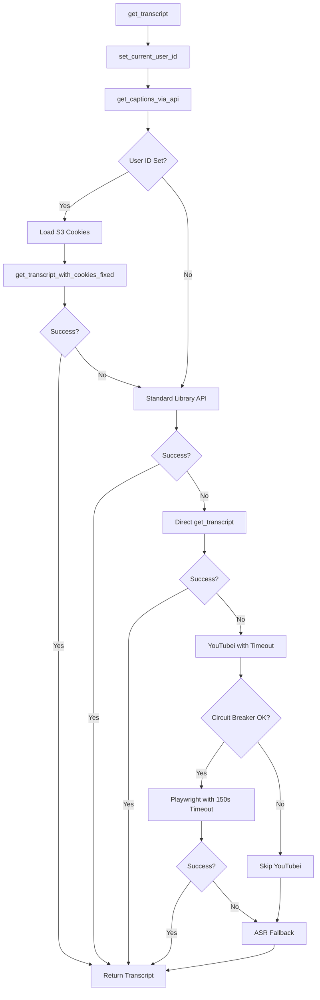
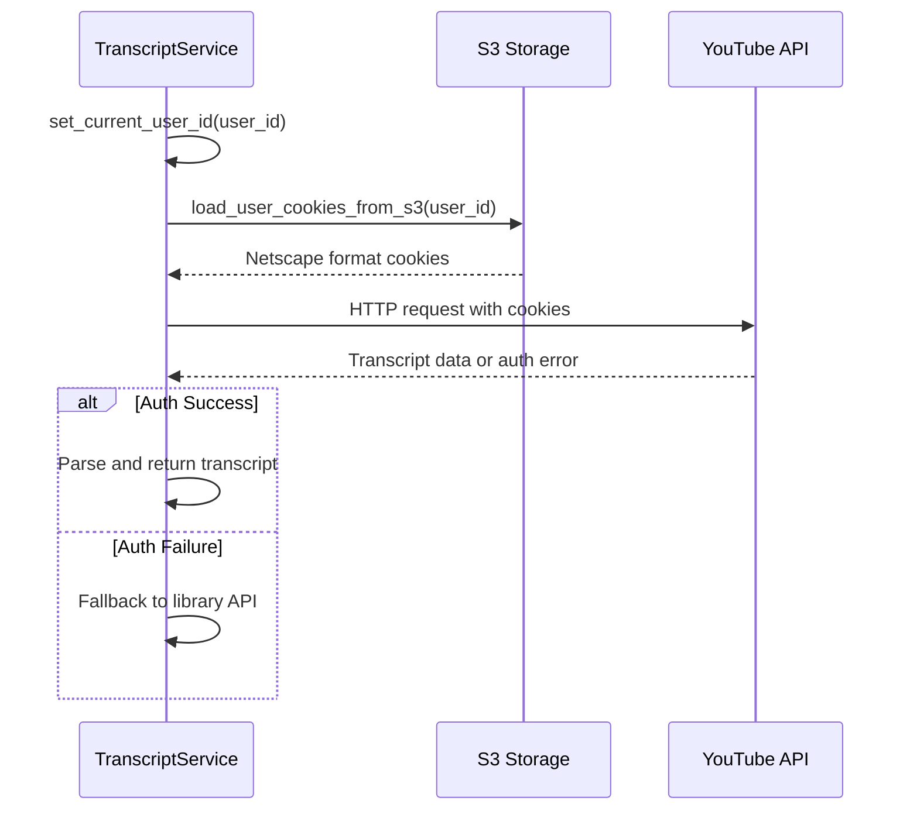

# Design Document

## Overview

This design enhances the TL;DW transcript service with improved cookie authentication, timeout protection, and error handling. The solution addresses critical production issues where transcript operations hang indefinitely and cookie authentication fails by implementing S3 cookie integration, YouTubei timeout enforcement, circuit breaker patterns, and enhanced error detection.

The design maintains backward compatibility while adding new capabilities for per-user cookie authentication and robust timeout handling.

## Architecture

### High-Level Flow



### Cookie Authentication Flow



## Components and Interfaces

### Enhanced TranscriptService Class

#### New Properties
```python
class TranscriptService:
    current_user_id: Optional[int] = None  # For cookie loading context
```

#### New Methods
```python
def set_current_user_id(self, user_id: int) -> None:
    """Set the current user ID for cookie loading operations."""
    
def get_captions_via_api(self, video_id: str, languages=("en", "en-US", "es")) -> str:
    """Enhanced YouTube Transcript API with cookie support and fallback strategies."""
```

#### Modified Methods
```python
def get_transcript(self, video_id: str, language: str = "en", 
                  user_cookies=None, playwright_cookies=None, 
                  user_id: Optional[int] = None) -> str:
    """Enhanced with user_id parameter for cookie context."""
```

### Cookie Loading System

#### Cookie Security Considerations

```python
# Cookie Security Guidelines
class CookieSecurityManager:
    @staticmethod
    def sanitize_cookie_logs(cookie_dict: Dict[str, str]) -> List[str]:
        """Return only cookie names for logging (never values)."""
        return list(cookie_dict.keys())
        
    @staticmethod
    def validate_cookie_format(cookie_content: str) -> bool:
        """Validate Netscape format before parsing."""
        
    @staticmethod
    def check_cookie_expiration(cookie_dict: Dict[str, str]) -> Dict[str, bool]:
        """Check which cookies are expired."""
```

#### S3 Integration
```python
def load_user_cookies_from_s3(user_id: int) -> Optional[Dict[str, str]]:
    """Load user cookies from S3 bucket with error handling."""
    # Implementation:
    # 1. Connect to s3://tldw-cookies-bucket/cookies/{user_id}.txt
    # 2. Parse Netscape format cookies
    # 3. Return cookie dictionary or None on failure
```

#### Cookie Resolution Priority
1. S3 cookies (per-user): `s3://tldw-cookies-bucket/cookies/{user_id}.txt`
2. Environment cookies: `COOKIES_HEADER`
3. Local file cookies: `COOKIE_DIR/cookies.txt`

### Enhanced HTTP Cookie Authentication

#### Direct HTTP Implementation
```python
def get_transcript_with_cookies_fixed(video_id: str, languages: List[str], 
                                    user_id: int, proxies=None) -> str:
    """Fixed version with proper cookie handling and error propagation."""
    # Implementation:
    # 1. Load user cookies from S3
    # 2. Make authenticated HTTP requests to YouTube transcript endpoints
    # 3. Include proper headers (User-Agent, Referer, Accept)
    # 4. Handle XML parsing errors as blocking indicators
    # 5. Return transcript text or empty string
```

### Timeout Protection System

#### YouTubei Timeout Enforcement
```python
def get_transcript_via_youtubei_with_timeout(video_id: str, language: str = "en", 
                                           max_duration_seconds: int = 150) -> str:
    """YouTubei with strict timeout enforcement and circuit breaker integration."""
    # Implementation:
    # 1. Check circuit breaker status
    # 2. Start timeout timer (150 seconds max)
    # 3. Execute Playwright operations with progress logging
    # 4. Abort on timeout with proper cleanup
    # 5. Update circuit breaker on success/failure
```

#### Circuit Breaker Pattern
```python
class PlaywrightCircuitBreaker:
    failure_count: int = 0
    last_failure_time: Optional[float] = None
    FAILURE_THRESHOLD = 3
    RECOVERY_TIME_MINUTES = 10
    
    def is_open(self) -> bool:
        """Check if circuit breaker is open (blocking operations)."""
        
    def record_success(self) -> None:
        """Reset failure count on successful operation."""
        
    def record_failure(self) -> None:
        """Increment failure count and activate if threshold reached."""
```

## Data Models

### Cookie Storage Format
```python
# S3 Storage: s3://tldw-cookies-bucket/cookies/{user_id}.txt
# Format: Netscape HTTP Cookie File
# Example:
# .youtube.com	TRUE	/	FALSE	1735689600	session_token	abc123
# .youtube.com	TRUE	/	TRUE	1735689600	secure_token	def456
```

### Error Response Structure
```python
@dataclass
class TranscriptError:
    error_type: str  # "timeout", "auth_failure", "xml_parse", "circuit_breaker"
    message: str
    video_id: str
    method: str  # "cookies", "library", "youtubei", "asr"
    elapsed_time: float
    user_id: Optional[int] = None
```

### Logging Structure
```python
# Success logging
logging.info(f"Direct HTTP transcript success for {video_id}")
logging.info(f"Library transcript success for {video_id}: {len(transcript_text)} chars")

# Error logging
logging.warning(f"YouTube Transcript API XML parsing error for {video_id}: {error_msg}")
logging.info("This usually indicates YouTube is blocking requests or the video has no transcript")

# Timeout logging
logging.warning(f"YouTubei timeout approaching for {video_id}: {remaining_time}s remaining")
logging.error(f"YouTubei operation aborted due to timeout for {video_id}: {elapsed_time}s elapsed")

# Circuit breaker logging
logging.warning("Playwright circuit breaker activated - skipping for 10 minutes")
logging.info(f"Circuit breaker blocking YouTubei operation for {video_id}")
```

## Error Handling

### Recovery Timeouts and Configuration

```python
# Recovery Timeouts
COOKIE_RETRY_DELAY = 30  # seconds between S3 cookie retry attempts
CIRCUIT_BREAKER_RECOVERY = 600  # 10 minutes circuit breaker timeout
YOUTUBEI_HARD_TIMEOUT = 150  # seconds maximum YouTubei operation time
PLAYWRIGHT_NAVIGATION_TIMEOUT = 60  # seconds for page navigation
```

### Resource Cleanup Management

```python
class ResourceCleanupManager:
    """Ensures proper cleanup of resources on timeout or failure."""
    
    def cleanup_playwright_resources(self, browser, context, page):
        """Clean up Playwright resources in proper order."""
        # 1. Close page if exists
        # 2. Close context if exists  
        # 3. Close browser if exists
        # 4. Log cleanup completion
        
    def cleanup_temp_files(self, temp_dir_path: str):
        """Clean up temporary files from ASR processing."""
        
    def cleanup_network_connections(self, session: requests.Session):
        """Close HTTP sessions and network connections."""
```

### Error Classification System

#### YouTube Blocking Detection
```python
def detect_youtube_blocking(error_message: str, response_content: str = "") -> bool:
    """Detect various forms of YouTube anti-bot blocking."""
    blocking_indicators = [
        "no element found: line 1, column 0",
        "ParseError",
        "XML document structures must start and end within the same entity"
    ]
    return any(indicator in error_message for indicator in blocking_indicators)
```

#### Timeout Error Handling
```python
def handle_timeout_error(video_id: str, elapsed_time: float, method: str) -> None:
    """Handle timeout errors with circuit breaker integration."""
    # 1. Log timeout details
    # 2. Update circuit breaker failure count
    # 3. Clean up resources (Playwright contexts, temp files)
    # 4. Return appropriate error response
```

### Graceful Degradation Strategy

1. **Cookie Authentication Failure**: Fall back to library API
2. **Library API Failure**: Fall back to direct get_transcript
3. **YouTubei Timeout**: Activate circuit breaker, skip to ASR
4. **Circuit Breaker Active**: Skip YouTubei entirely
5. **All Methods Fail**: Return empty string (don't raise exceptions)

## Testing Strategy

### Unit Tests

#### Cookie Loading Tests
```python
def test_load_s3_cookies_success():
    """Test successful S3 cookie loading and parsing."""
    
def test_load_s3_cookies_fallback():
    """Test fallback to environment cookies when S3 fails."""
    
def test_cookie_priority_resolution():
    """Test that S3 cookies take precedence over environment cookies."""
```

#### Timeout Protection Tests
```python
def test_youtubei_timeout_enforcement():
    """Test that YouTubei operations abort after 150 seconds."""
    
def test_circuit_breaker_activation():
    """Test circuit breaker activates after 3 consecutive failures."""
    
def test_timeout_logging():
    """Test that timeout warnings are logged appropriately."""
```

#### Error Detection Tests
```python
def test_youtube_blocking_detection():
    """Test detection of various YouTube blocking patterns."""
    
def test_xml_parse_error_handling():
    """Test handling of XML parsing errors as blocking indicators."""
```

### Integration Tests

#### End-to-End Cookie Flow
```python
def test_user_cookie_transcript_flow():
    """Test complete flow from user_id to transcript with S3 cookies."""
    
def test_cookie_authentication_failure_fallback():
    """Test fallback behavior when cookie authentication fails."""
```

#### Timeout Integration
```python
def test_timeout_with_circuit_breaker():
    """Test timeout handling integrates properly with circuit breaker."""
    
def test_playwright_cleanup_on_timeout():
    """Test that Playwright resources are cleaned up on timeout."""
```

### Performance Tests

#### Performance Benchmarks

```python
# Expected Performance Benchmarks
S3_COOKIE_LOADING_MAX_LATENCY = 500  # milliseconds
DIRECT_HTTP_TRANSCRIPT_MAX_LATENCY = 5000  # milliseconds
YOUTUBEI_AVERAGE_SUCCESS_TIME = 45000  # milliseconds
CIRCUIT_BREAKER_ACTIVATION_TIME = 10  # milliseconds
```

#### Cookie Loading Performance
```python
def test_s3_cookie_loading_latency():
    """Ensure S3 cookie loading doesn't add significant latency."""
    
def test_cookie_caching_effectiveness():
    """Test that cookies are cached appropriately to avoid repeated S3 calls."""
```

#### Timeout Accuracy
```python
def test_timeout_accuracy():
    """Verify that timeout enforcement is accurate within acceptable margins."""
```

## Deployment Considerations

### Environment Variables
```bash
# S3 Cookie Storage
COOKIE_S3_BUCKET=tldw-cookies-bucket

# Timeout Configuration
YOUTUBEI_MAX_DURATION_SECONDS=150
PLAYWRIGHT_CIRCUIT_BREAKER_ENABLED=true

# Feature Flags
ENABLE_S3_COOKIES=true
ENABLE_TIMEOUT_PROTECTION=true
```

### IAM Permissions
```json
{
    "Version": "2012-10-17",
    "Statement": [
        {
            "Effect": "Allow",
            "Action": [
                "s3:GetObject"
            ],
            "Resource": "arn:aws:s3:::tldw-cookies-bucket/cookies/*"
        }
    ]
}
```

### Monitoring and Observability

#### Key Metrics
- Cookie loading success/failure rates
- S3 vs environment cookie usage ratios
- YouTubei timeout frequency
- Circuit breaker activation events
- Transcript success rates by method

#### Health Check Enhancements
```python
# Add to /healthz endpoint
{
    "cookie_loading": {
        "s3_available": bool,
        "last_s3_success": timestamp,
        "environment_fallback_active": bool
    },
    "timeout_protection": {
        "circuit_breaker_status": "open|closed",
        "last_timeout_event": timestamp,
        "average_youtubei_duration": float
    }
}
```

### Rollback Strategy

1. **Feature Flags**: Disable new functionality via environment variables
2. **Function Replacement**: Revert to original function implementations
3. **Cookie Fallback**: Disable S3 cookies, use environment cookies only
4. **Timeout Bypass**: Disable timeout enforcement if causing issues

The design ensures that all enhancements can be disabled independently without breaking existing functionality.