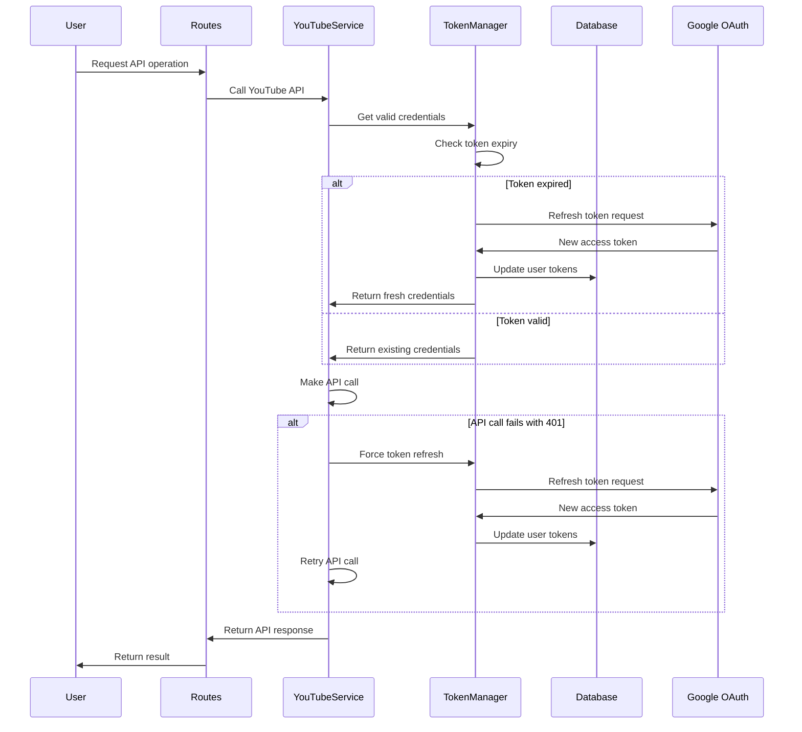

# Design Document

## Overview

This design addresses the OAuth refresh token issue by implementing proper token lifecycle management in the Google OAuth flow. The solution ensures that refresh tokens are properly requested, stored, and used to automatically refresh expired access tokens, preventing authentication failures during API calls.

## Architecture

The OAuth refresh token fix involves modifications to three main components:

1. **Authentication Flow** (`google_auth.py`) - Enhanced to properly request and store refresh tokens
2. **YouTube Service** (`youtube_service.py`) - Enhanced with automatic token refresh capability
3. **User Model** (`models.py`) - Already has refresh token storage, no changes needed

### Current State Analysis

The current implementation already includes:
- `access_type="offline"` and `prompt="consent"` in the OAuth request
- Refresh token storage in the User model
- Basic token storage in the callback handler

However, it lacks:
- Automatic token refresh when access tokens expire
- Proper error handling for authentication failures
- Token refresh retry logic

## Components and Interfaces

### 1. Enhanced Authentication Service

**Location**: `google_auth.py`

**Enhancements**:
- Improved error handling in the callback function
- Better logging for token acquisition debugging
- Validation that refresh tokens are properly received

### 2. Token Refresh Manager

**New Component**: `token_manager.py`

**Responsibilities**:
- Refresh expired access tokens using stored refresh tokens
- Update user credentials in the database
- Handle refresh token expiration scenarios
- Provide centralized token management for all services

**Interface**:
```python
class TokenManager:
    def __init__(self, user):
        self.user = user
    
    def refresh_access_token(self) -> bool:
        """Refresh the user's access token using refresh token"""
        
    def get_valid_credentials(self) -> Credentials:
        """Get valid OAuth2 credentials, refreshing if necessary"""
        
    def is_token_expired(self, credentials) -> bool:
        """Check if access token is expired or about to expire"""
```

### 3. Enhanced YouTube Service

**Location**: `youtube_service.py`

**Enhancements**:
- Integration with TokenManager for automatic token refresh
- Retry logic for 401 authentication errors
- Improved error handling and logging

**Modified Interface**:
```python
class YouTubeService:
    def __init__(self, user):  # Changed from access_token to user object
        self.user = user
        self.token_manager = TokenManager(user)
        self.youtube = self._build_service()
    
    def _build_service(self):
        """Build YouTube service with valid credentials"""
        
    def _handle_auth_error(self, func, *args, **kwargs):
        """Wrapper to handle authentication errors with retry"""
```

### 4. Route Error Handling

**Location**: `routes.py`

**Enhancements**:
- Better error handling for authentication failures
- User-friendly error messages
- Redirect to re-authentication when necessary

## Data Models

### User Model (No Changes Required)

The existing User model already supports the required fields:
- `access_token` - OAuth2 access token
- `refresh_token` - OAuth2 refresh token

### Token Refresh Flow



## Error Handling

### Authentication Error Scenarios

1. **Expired Access Token**
   - Automatic refresh using stored refresh token
   - Retry original API call
   - Log successful refresh

2. **Invalid/Expired Refresh Token**
   - Log error with specific details
   - Clear stored tokens
   - Redirect user to re-authentication
   - Preserve user's intended action

3. **Missing Refresh Token**
   - Log warning about missing refresh token
   - Redirect to re-authentication with `prompt=consent`
   - Store user's intended action for post-auth redirect

4. **Network/API Errors During Refresh**
   - Implement exponential backoff retry
   - Log detailed error information
   - Fallback to re-authentication after max retries

### Error Response Structure

```python
{
    "error_type": "authentication_failed",
    "message": "Your session has expired. Please sign in again.",
    "action_required": "re_authenticate",
    "redirect_url": "/google_login",
    "preserve_action": True
}
```

## Testing Strategy

### Unit Tests

1. **TokenManager Tests**
   - Test successful token refresh
   - Test expired refresh token handling
   - Test missing refresh token scenarios
   - Test network error handling

2. **YouTubeService Tests**
   - Test automatic retry on 401 errors
   - Test service initialization with user object
   - Test API call success after token refresh

3. **Authentication Flow Tests**
   - Test callback with refresh token
   - Test callback without refresh token
   - Test error handling in OAuth flow

### Integration Tests

1. **End-to-End Authentication Flow**
   - Complete OAuth flow with refresh token
   - Token expiry and automatic refresh
   - API calls after token refresh

2. **Error Scenario Testing**
   - Simulate expired access tokens
   - Simulate invalid refresh tokens
   - Test user experience during re-authentication

### Manual Testing Scenarios

1. **Token Expiry Simulation**
   - Manually expire access token in database
   - Verify automatic refresh works
   - Verify API calls succeed after refresh

2. **Refresh Token Validation**
   - Verify refresh tokens are stored during login
   - Test with users who don't have refresh tokens
   - Verify re-authentication flow works

## Implementation Considerations

### Security

- Store tokens securely in database (already implemented)
- Use HTTPS for all OAuth communications (already configured)
- Implement proper token validation
- Clear tokens on logout

### Performance

- Cache valid credentials to avoid unnecessary refresh checks
- Implement efficient token expiry checking
- Use connection pooling for database operations
- Minimize API calls during token refresh

### User Experience

- Seamless token refresh without user interruption
- Clear error messages when re-authentication is needed
- Preserve user's intended action across authentication flows
- Minimize login prompts for existing users

### Monitoring and Logging

- Log all token refresh attempts
- Monitor refresh token success/failure rates
- Track authentication error patterns
- Alert on high authentication failure rates