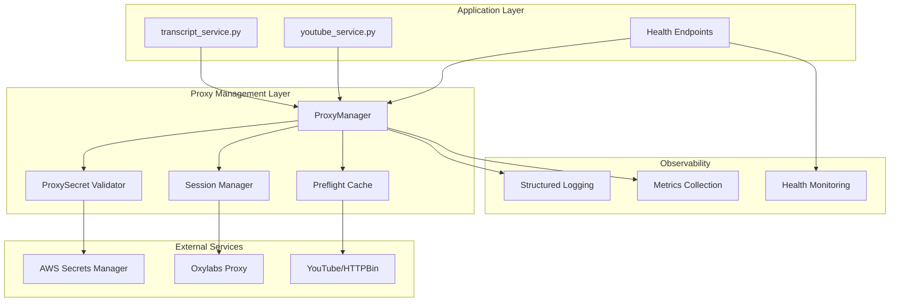
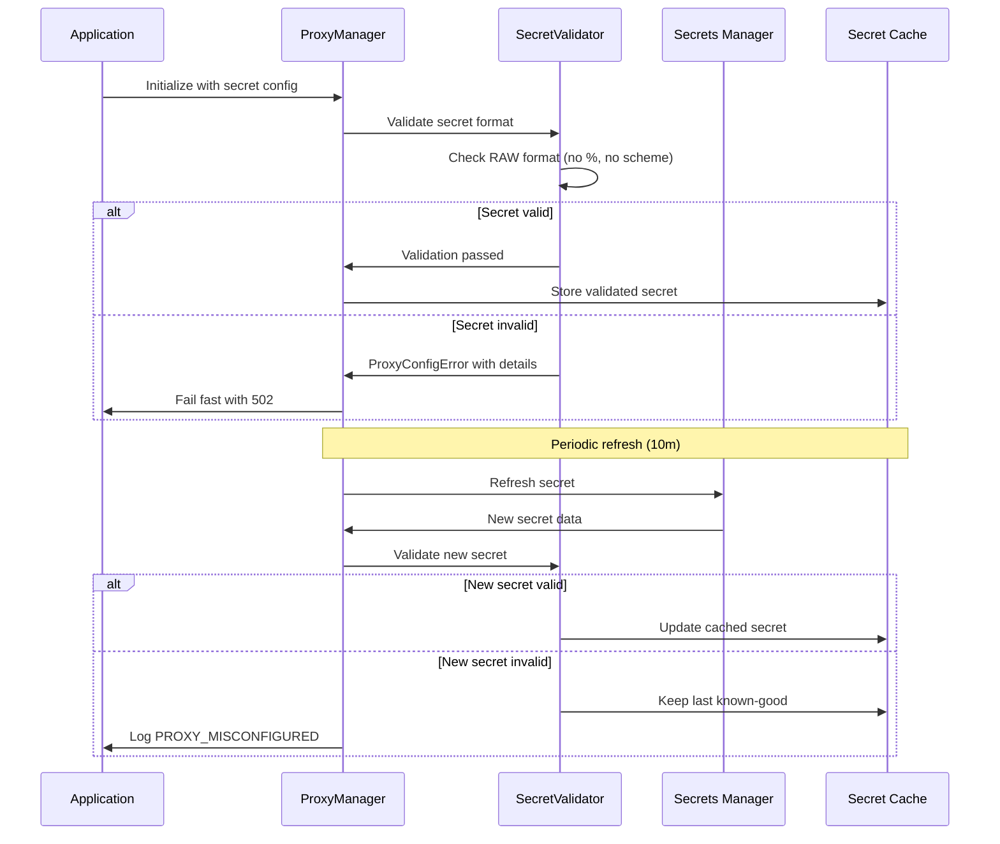
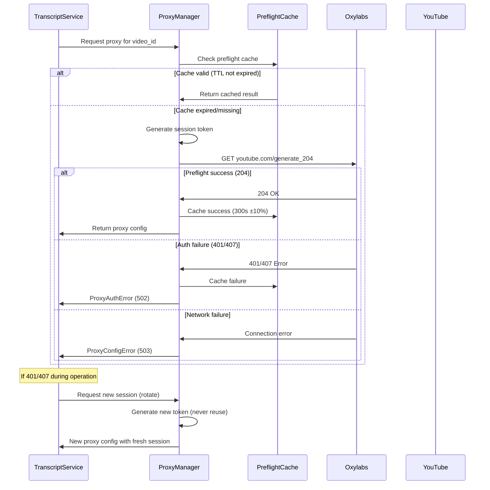

# Design Document

## Overview

This design implements a robust proxy authentication system that eliminates recurring 407 errors through strict secret validation, preflight checks, and fail-fast mechanisms. The solution enforces a RAW secret contract, implements session rotation, and provides comprehensive observability to ensure reliable proxy operations.

The core principle is "fail-fast and never retry with broken sessions" - if proxy authentication fails, we immediately abort without attempting transcript/yt-dlp operations and generate fresh sessions for any retries.

## Architecture

### High-Level Architecture



### Secret Management Flow



### Preflight and Session Management



## Module Imports

```python
# Core Python modules
import os
import json
import uuid
import time
import random
import secrets
import hashlib
import logging
import threading
from collections import deque
from dataclasses import dataclass
from datetime import datetime
from urllib.parse import quote, unquote, urlparse
from typing import Dict, Optional

# Third-party modules
import requests
import yt_dlp
from fastapi import FastAPI
from fastapi.responses import JSONResponse

# Application modules (implementation-specific)
from .exceptions import ProxyError, ProxyConfigError, ProxyAuthError, ProxyValidationError
```

## Components and Interfaces

### 1. ProxySecret Data Class

**Purpose:** Enforce strict secret contract and validation

```python
@dataclass
class ProxySecret:
    provider: str
    host: str
    port: int
    username: str          # base username, no -sessid-
    password: str          # RAW (not URL-encoded)
    geo_enabled: bool = False
    country: Optional[str] = None
    version: int = 1
    
    @classmethod
    def from_dict(cls, d: Dict) -> 'ProxySecret':
        """Validate and create ProxySecret from dict"""
        req = ["provider", "host", "port", "username", "password"]
        for k in req:
            v = d.get(k)
            if v is None or (isinstance(v, str) and not v.strip()):
                raise ProxyValidationError(f"proxy_secret_missing_{k}")
        
        host = str(d["host"])
        if host.startswith(("http://", "https://")):
            raise ProxyValidationError("proxy_secret_host_contains_scheme")
        
        pw = str(d["password"])
        if looks_preencoded(pw):
            raise ProxyValidationError("proxy_secret_password_looks_urlencoded")
        
        return cls(
            provider=str(d["provider"]).lower(),
            host=host,
            port=int(d["port"]),
            username=str(d["username"]),
            password=pw,
            geo_enabled=bool(d.get("geo_enabled", False)),
            country=str(d.get("country")) if d.get("country") else None,
            version=int(d.get("version", 1)),
        )
        
    def build_username_with_session(self, session_token: str) -> str:
        """Create session-specific username"""
        base = self.username.split("-sessid-")[0]
        return f"{base}-sessid-{session_token}"
        
    def build_proxy_url(self, session_token: Optional[str] = None) -> str:
        """Build proxy URL with runtime password encoding"""
        user = self.username if session_token is None else self.build_username_with_session(session_token)
        return f"http://{user}:{quote(self.password, safe='')}@{self.host}:{self.port}"
```

**Validation Rules:**
- Host must not contain `http://` or `https://`
- Password must not be pre-URL-encoded (detected via quote/unquote roundtrip)
- All required fields must be present and non-empty
- Port must be valid integer

```python
from urllib.parse import quote, unquote

def looks_preencoded(pw: str) -> bool:
    """Detect if password was already URL-encoded"""
    try:
        return quote(unquote(pw), safe="") != pw
    except Exception:
        return False
```

### 2. ProxyManager Class

**Purpose:** Central proxy management with preflight and session handling

```python
import secrets
import threading
from collections import deque
from time import time

class ProxyManager:
    def __init__(self, secret_dict: Dict, logger):
        self.logger = logger  # Store logger reference
        self.secret = ProxySecret.from_dict(secret_dict)
        self.preflight_cache = PreflightCache()
        self.session_blacklist = BoundedBlacklist(max_size=1000, ttl=3600)
        self._preflight_lock = threading.Lock()  # Single-flight guard
        self._preflight_count = 0
        self._preflight_window_start = time()
        self._healthy: Optional[bool] = None  # Track for /health/ready
        
    @property
    def healthy(self) -> Optional[bool]:
        """Get cached health status"""
        if self._healthy is not None:
            return self._healthy
        cached = self.preflight_cache.get()
        return cached.healthy if cached else None
        
    def preflight(self, timeout: float = 5.0) -> bool:
        """Perform cached preflight check with stampede control"""
        # Rate limiting: max 10 preflights per minute
        now = time.time()
        if now - self._preflight_window_start > 60:
            self._preflight_count = 0
            self._preflight_window_start = now
        
        max_per_minute = int(os.getenv("OXY_PREFLIGHT_MAX_PER_MINUTE", "10"))
        if self._preflight_count >= max_per_minute:
            cached = self.preflight_cache.get()
            return cached.healthy if cached else False
            
        with self._preflight_lock:  # Single-flight
            cached = self.preflight_cache.get()
            if cached and not self.preflight_cache.is_expired():
                self._healthy = cached.healthy
                return cached.healthy
            
            self._preflight_count += 1
            
            # Perform actual preflight
            proxies = self.proxies_for(None)
            last_err = None
            
            for url in ("https://www.youtube.com/generate_204", "https://httpbin.org/status/204"):
                try:
                    r = requests.get(url, proxies=proxies, timeout=timeout)
                    if r.status_code == 204:
                        self.preflight_cache.set(True)
                        self._healthy = True
                        return True
                    if r.status_code in (401, 407):
                        self.preflight_cache.set(False, f"auth_{r.status_code}")
                        self._healthy = False
                        raise ProxyAuthError(f"proxy_auth_failed_{r.status_code}")
                    r.raise_for_status()
                except requests.RequestException as e:
                    last_err = e
                    continue
            
            # All URLs failed
            self.preflight_cache.set(False, str(last_err) if last_err else "unknown")
            self._healthy = False
            raise ProxyConfigError(f"proxy_preflight_unreachable: {last_err}")
        
    def proxies_for(self, video_id: Optional[str] = None) -> Dict[str, str]:
        """Get proxy config with unique session"""
        token = self._generate_session_token(video_id)
        # Ensure we don't reuse blacklisted tokens
        while token in self.session_blacklist:
            token = self._generate_session_token(video_id)
        
        return {"http": self.secret.build_proxy_url(token), 
                "https": self.secret.build_proxy_url(token)}
        
    def _generate_session_token(self, video_id: Optional[str] = None) -> str:
        """Generate cryptographically secure session token"""
        base_token = secrets.token_urlsafe(12)
        if video_id:
            # Add short video hash for locality
            video_hash = hashlib.sha256(video_id.encode()).hexdigest()[:6]
            return f"{video_hash}{base_token}"
        return base_token
        
    def rotate_session(self, failed_token: str):
        """Blacklist failed session and force new token"""
        # Only log last 4 chars to prevent token leakage
        self.logger.info(f"Blacklisting session: ...{failed_token[-4:]}")
        self.session_blacklist.add(failed_token)

class BoundedBlacklist:
    """Thread-safe bounded blacklist with TTL"""
    def __init__(self, max_size: int = 1000, ttl: int = 3600):
        self.max_size = max_size
        self.ttl = ttl
        self._items = deque()
        self._lookup = set()
        self._lock = threading.Lock()
        
    def add(self, token: str):
        with self._lock:
            if token in self._lookup:
                return
            
            now = time.time()
            self._items.append((token, now))
            self._lookup.add(token)
            
            # Cleanup expired and enforce size limit
            self._cleanup(now)
            
    def __contains__(self, token: str) -> bool:
        """Check if token is blacklisted"""
        with self._lock:
            return token in self._lookup
            
    def _cleanup(self, now: float):
        # Remove expired items
        while self._items and time.time() - self._items[0][1] > self.ttl:
            old_token, _ = self._items.popleft()
            self._lookup.discard(old_token)
            
        # Enforce size limit
        while len(self._items) > self.max_size:
            old_token, _ = self._items.popleft()
            self._lookup.discard(old_token)
```

### 3. Preflight Cache

**Purpose:** Cache preflight results to avoid excessive external calls

```python
import os
import random
import requests
import hashlib
from dataclasses import dataclass
from datetime import datetime
from urllib.parse import quote, unquote

@dataclass
class PreflightResult:
    healthy: bool
    timestamp: datetime
    ttl_seconds: int
    error_message: Optional[str] = None
    
class PreflightCache:
    def __init__(self, default_ttl: int = int(os.getenv("OXY_PREFLIGHT_TTL_SECONDS", "300"))):
        self._cache: Optional[PreflightResult] = None
        self._jitter = 0.10
        self._default_ttl = default_ttl
        
    def get(self) -> Optional[PreflightResult]:
        """Get cached result if not expired"""
        return self._cache
        
    def set(self, healthy: bool, error_message: Optional[str] = None):
        """Cache new result with jittered TTL"""
        ttl = int(self._default_ttl * (1 + random.uniform(-self._jitter, self._jitter)))
        self._cache = PreflightResult(
            healthy=healthy, 
            timestamp=datetime.utcnow(), 
            ttl_seconds=ttl, 
            error_message=error_message
        )
        
    def is_expired(self) -> bool:
        """Check if cache needs refresh"""
        if not self._cache:
            return True
        age = (datetime.utcnow() - self._cache.timestamp).total_seconds()
        return age >= self._cache.ttl_seconds
```

### 4. Structured Logger

**Purpose:** Safe logging that never crashes and accepts unknown fields

```python
import logging
import json

class SafeStructuredLogger:
    LEVELS = {"debug": 10, "info": 20, "warning": 30, "error": 40, "critical": 50}
    
    def __init__(self, base_logger):
        self.logger = base_logger
        
    def log_event(self, level: str, message: str, **kwargs):
        """Log structured event, using deny-list for sensitive fields"""
        try:
            # Convert string level to int
            log_level = self.LEVELS.get(level.lower(), 20)
            
            # Sanitize fields and wrap under 'evt' to avoid LogRecord collisions
            safe_data = self._sanitize_fields(kwargs)
            self.logger.log(log_level, message, extra={"evt": safe_data})
        except Exception:
            # Never crash the pipeline due to logging
            try:
                self.logger.error(f"Logging failed for: {message}")
            except:
                pass  # Ultimate fallback - never crash
            
    def _sanitize_fields(self, data: Dict) -> Dict:
        """Remove sensitive data using deny-list, ensure serializability"""
        deny_fields = {"password", "proxy_url", "username"}  # Strip sensitive fields
        result = {}
        
        for k, v in data.items():
            if k in deny_fields:
                continue  # Skip sensitive fields
                
            try:
                # Ensure value is JSON-serializable
                json.dumps(v)
                result[k] = v
            except (TypeError, ValueError):
                result[k] = str(v)  # Fallback to string representation
                
        return result
```

### 5. Health Endpoints

**Purpose:** Provide liveness and readiness checks for App Runner

```python
import uuid
from urllib.parse import urlparse
from fastapi import FastAPI
from fastapi.responses import JSONResponse

app = FastAPI()

@app.get("/health/live")
def health_live():
    """Always returns 200 if process is running"""
    return {"status": "ok", "timestamp": datetime.utcnow().isoformat()}

@app.get("/health/ready")
def health_ready():
    """Returns proxy health status from cache (non-recursive)"""
    pm = get_proxy_manager()
    
    # If no cached result, trigger preflight
    if pm.healthy is None:
        try:
            pm.preflight()
        except Exception as e:
            return JSONResponse(
                content={"status": "not_ready", "proxy_healthy": False, "reason": str(e)},
                status_code=503,
                headers={"Retry-After": "30"}
            )
    
    # Return cached result
    if pm.healthy:
        return {"status": "ready", "proxy_healthy": True}
    else:
        return JSONResponse(
            content={"status": "not_ready", "proxy_healthy": False},
            status_code=503,
            headers={"Retry-After": "30"}
        )

def generate_correlation_id() -> str:
    """Generate UUID for request correlation"""
    return str(uuid.uuid4())

def get_proxy_manager():
    """Factory for ProxyManager with loaded secret and logger"""
    secret_data = load_secret_from_source()  # Implementation depends on env
    logger = get_application_logger()
    return ProxyManager(secret_data, logger)

def extract_session_from_proxies(proxies: Dict[str, str]) -> str:
    """Extract session token from proxy URL"""
    try:
        username = urlparse(proxies["https"]).username or ""
        return username.split("-sessid-")[1]
    except Exception:
        return ""
```

## Data Models

### Error Response Format

```python
@dataclass
class ErrorResponse:
    code: str  # PROXY_AUTH_FAILED, PROXY_MISCONFIGURED, PROXY_UNREACHABLE
    message: str
    correlation_id: str
    timestamp: str
    details: Optional[Dict] = None

# HTTP Status Code Mapping:
HTTP_MAP = {
    "PROXY_AUTH_FAILED": 502,    # 401/407 upstream
    "PROXY_MISCONFIGURED": 502,  # Invalid secret format
    "PROXY_UNREACHABLE": 503,    # Network connectivity issues
}

def error_response(code: str, correlation_id: str, message: Optional[str] = None, details: Optional[Dict] = None):
    """Generate standardized error response"""
    body = {
        "code": code,
        "message": message or {
            "PROXY_AUTH_FAILED": "Proxy authentication failed. Ensure RAW creds (not URL-encoded) and host/port present.",
            "PROXY_MISCONFIGURED": "Proxy secret invalid. See required schema.",
            "PROXY_UNREACHABLE": "Proxy unreachable. Try again later.",
        }.get(code, "Unexpected error"),
        "correlation_id": correlation_id,
        "timestamp": datetime.utcnow().isoformat() + "Z",
        "details": details or {},
    }
    return body, HTTP_MAP.get(code, 500)
```

### Secret Schema (AWS Secrets Manager)

```json
{
  "provider": "oxylabs",
  "host": "pr.oxylabs.io",
  "port": 7777,
  "username": "customer-<account>",
  "password": "<RAW_PASSWORD>",
  "geo_enabled": false,
  "country": "us",
  "version": 1
}
```

### Metrics Schema

```python
# Counter metrics with stable prefixes (CloudWatch/StatsD compatible):
METRICS = {
    'proxy.preflight.ok': 'Successful preflight checks',
    'proxy.preflight.407': 'Preflight 407 auth failures', 
    'proxy.preflight.other': 'Other preflight failures',
    'ytdlp.407': 'yt-dlp 407 errors during operation',
    'transcript.success': 'Successful transcript operations',
    'asr.fallback': 'ASR fallback operations used',
    'cookies.invalid': 'Invalid cookie file detected',
    'session.rotated': 'Session tokens rotated due to auth failure'
}

# SLO: proxy.preflight.ok_rate ≥ 99% over 15m
# Target sink: CloudWatch Custom Metrics
```

## Error Handling

### Exception Hierarchy

```python
class ProxyError(Exception):
    """Base proxy error"""
    pass

class ProxyConfigError(ProxyError):
    """Local proxy configuration issues"""
    pass

class ProxyAuthError(ProxyError):
    """Proxy authentication failure (401/407)"""
    pass

class ProxyValidationError(ProxyError):
    """Secret validation failure"""
    pass
```

### Error Recovery Strategies

1. **Secret Validation Failure**
   - Fail fast with clear error message
   - Provide example of correct format
   - Never attempt operations with invalid secrets

2. **Preflight Authentication Failure**
   - Return 502 immediately
   - Do not attempt transcript/yt-dlp operations
   - Cache failure to avoid repeated attempts

3. **Session Authentication Failure**
   - Blacklist failed session token
   - Generate new session for retry
   - Cap retry attempts (default: 2)

4. **Network Connectivity Issues**
   - Return 503 (service unavailable)
   - Distinguish from authentication failures
   - Allow retry with backoff

## Integration Points

### 1. Transcript Service Integration

```python
class TranscriptService:
    def __init__(self):
        self.proxy_manager = ProxyManager(load_secret(), logger)
        self.logger = SafeStructuredLogger(base_logger)
        
    def get_transcript(self, video_id: str) -> Dict:
        correlation_id = generate_correlation_id()
        
        try:
            # Preflight check
            if not self.proxy_manager.preflight():
                self.logger.log_event('error', 'Proxy preflight failed',
                    component='transcript', step='preflight', 
                    video_id=video_id, status='proxy_auth_failed',
                    correlation_id=correlation_id)
                return error_response('PROXY_AUTH_FAILED', correlation_id)
                
            # Get proxy config with unique session
            proxies = self.proxy_manager.proxies_for(video_id)
            
            # Attempt transcript with fallback chain
            return self._attempt_transcript_chain(video_id, proxies, correlation_id)
            
        except ProxyConfigError as e:
            return error_response('PROXY_MISCONFIGURED', correlation_id, str(e))
            
    def _attempt_transcript_chain(self, video_id: str, proxies: Dict, correlation_id: str):
        """Attempt transcript with session rotation on auth failures"""
        session_token = extract_session_from_proxies(proxies)
        
        try:
            # Try transcript API first
            return self._get_transcript_api(video_id, proxies)
        except requests.HTTPError as e:
            if e.response.status_code in BLOCK_STATUSES:
                # Rotate session on auth/blocking failure
                self.proxy_manager.rotate_session(session_token)
                self.logger.log_event('warning', 'Transcript blocked, rotating session',
                    component='transcript', step='auth_failure', 
                    video_id=video_id, correlation_id=correlation_id,
                    status_code=e.response.status_code)
                # One retry with fresh session
                fresh_proxies = self.proxy_manager.proxies_for(video_id)
                return self._get_transcript_api(video_id, fresh_proxies)
            raise
```

### 2. YouTube Service Integration

```python
import os

# Status codes that trigger session rotation
BLOCK_STATUSES = {401, 403, 407, 429}

class YouTubeService:
    def __init__(self, proxy_manager, logger, metrics):
        self.proxy_manager = proxy_manager
        self.logger = logger
        self.metrics = metrics
        
    def download_with_ytdlp(self, video_id: str, proxies: Dict) -> Dict:
        session_token = extract_session_from_proxies(proxies)
        correlation_id = generate_correlation_id()
        
        try:
            # Fast-fail cookie check
            cookiefile = self._get_valid_cookiefile()
            cookies_valid = self._validate_cookiefile(cookiefile)
            
            self.logger.log_event('info', 'Starting yt-dlp download',
                component='youtube', step='download', video_id=video_id,
                correlation_id=correlation_id, cookies_valid=cookies_valid)
            
            # Configure yt-dlp with proxy
            ydl_opts = {
                'proxy': proxies['https'],
                'ffmpeg_location': '/usr/bin'  # Container path
            }
            if cookies_valid:
                ydl_opts['cookiefile'] = cookiefile
            
            with yt_dlp.YoutubeDL(ydl_opts) as ydl:
                return ydl.extract_info(f"https://youtube.com/watch?v={video_id}")
                
        except yt_dlp.utils.ExtractorError as e:
            # Check for auth/blocking status codes
            if any(str(status) in str(e) for status in BLOCK_STATUSES):
                # Blacklist this session
                self.proxy_manager.rotate_session(session_token)
                self.metrics.increment('ytdlp.407')
                raise ProxyAuthError(f"Authentication/blocking failed: {e}")
            raise
            
    def _validate_cookiefile(self, cookiefile: str) -> bool:
        """Quick cookie sanity check"""
        try:
            if not os.path.exists(cookiefile):
                return False
            
            # Check file size (>1KB)
            if os.path.getsize(cookiefile) < 1024:
                return False
                
            # Check for essential YouTube cookies
            with open(cookiefile, 'r') as f:
                content = f.read()
                return any(cookie in content for cookie in ['SID', 'SAPISID', 'HSID'])
                
        except Exception:
            return False
```

## Configuration Management

### Environment Variables

```python
# Required
OXY_SECRETS_MANAGER_NAME: str  # No hardcoded secret names

# Optional with defaults
OXY_PREFLIGHT_DISABLED: bool = False
OXY_PREFLIGHT_TTL_SECONDS: int = 300
OXY_PREFLIGHT_MAX_PER_MINUTE: int = 10  # Configurable rate limit
OXY_DISABLE_GEO: bool = True  # Current hotfix
OXY_PROVIDER: str = "oxylabs"
OXY_MAX_RETRY_ATTEMPTS: int = 2
OXY_RETRY_BACKOFF_FACTOR: float = 2.0
```

### Secret Precedence

1. **RuntimeEnvironmentSecrets JSON** (App Runner)
2. **AWS Secrets Manager** (production)
3. **Environment Variables** (local development only)

### Secret Refresh Strategy

```python
class SecretRefreshManager:
    def __init__(self, refresh_interval: int = 600):  # 10 minutes
        self.refresh_interval = refresh_interval
        self.last_known_good: Optional[ProxySecret] = None
        
    def refresh_secret(self) -> ProxySecret:
        try:
            new_secret_data = load_secret_from_source()
            new_secret = ProxySecret.from_dict(new_secret_data)
            self.last_known_good = new_secret
            return new_secret
        except (ProxyValidationError, ProxyConfigError) as e:
            if self.last_known_good:
                logger.warning(f"New secret invalid ({e}), using last known-good")
                return self.last_known_good
            raise
```

## Security Considerations

### Credential Protection
- Never log raw passwords or proxy URLs
- URL-encode passwords only at runtime
- Use structured logging with field sanitization
- Implement correlation IDs for request tracing

### Session Security
- Generate cryptographically random session tokens
- Never reuse tokens that encountered auth failures
- Implement session token blacklisting
- Use time-based tokens to prevent long-term reuse

### Secret Management
- Enforce RAW format in AWS Secrets Manager
- Validate secret format before use
- Implement secure secret refresh without downtime
- Use least-privilege IAM permissions

## Performance Considerations

### Caching Strategy
- Cache preflight results for 300s ±10% jitter
- Avoid excessive external calls to YouTube
- Background refresh when TTL expires
- In-memory caching for single-instance deployment
- Single-flight guard prevents stampeding herd on cache expiry

### Connection Management
- Reuse HTTP connections where possible
- Implement appropriate timeouts (5s default)
- Use connection pooling for proxy requests
- Implement circuit breaker for repeated failures

### Resource Usage
- Limit concurrent preflight checks (max 10/minute)
- Cap retry attempts to prevent resource exhaustion
- Use exponential backoff for retries
- Bounded session blacklist (max 1000 items, 1h TTL)
- Monitor memory usage and implement cleanup

### Health Check Configuration
- **App Runner Probe Intervals**: 20-30 seconds (avoid tight intervals <10s)
- **Use /health/ready for scaling decisions** (not /health/live)
- **Readiness semantics**: Returns cached proxy state, may trigger background refresh
- **Liveness semantics**: Always returns 200 if process responds

## Testing Strategy

### Unit Tests
- Secret validation with various malformed inputs
- Session token generation and uniqueness
- Preflight cache TTL and jitter behavior
- Structured logging with unknown fields
- Error response format consistency

### Integration Tests
- Mock proxy returning 407/401/204 responses
- Secret refresh with invalid new secrets
- Health endpoint behavior under various conditions
- End-to-end proxy authentication flow

### Load Testing
- Preflight cache performance under load
- Session rotation under concurrent requests
- Memory usage with large session blacklists
- Health endpoint response times

### Critical Test Cases

**Validator Tests:**
- Host scheme rejection (`http://` and `https://` prefixes)
- URL-encoded password detection (quote/unquote round-trip)
- Missing required fields (provider, host, port, username, password)

**Preflight Tests:**
- 204 response → cache success and HTTP 200
- 401/407 response → cache failure and HTTP 502 (PROXY_AUTH_FAILED)
- Network errors → HTTP 503 (PROXY_UNREACHABLE)

**Session Management Tests:**
- Blacklist growth and TTL cleanup
- Non-reuse guarantee after 401/407
- Token collision avoidance

**Logging Tests:**
- Unknown fields don't crash pipeline
- Sensitive fields (password, proxy_url, username) stripped
- Event payload wrapped under "evt" key

This design provides a robust, fail-fast proxy authentication system that eliminates the "whack-a-mole" 407 errors through strict validation, intelligent caching, and comprehensive observability.