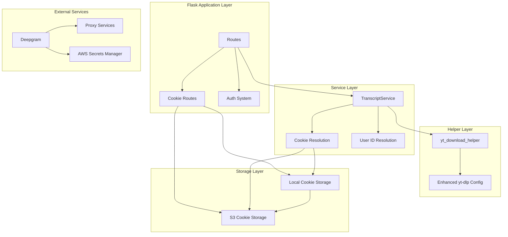

# Design Document

## Overview

This design implements per-user cookie support and yt-dlp hardening for the TL;DW YouTube video summarization service. The solution enhances the existing architecture by adding user-specific authentication capabilities while maintaining backwards compatibility and preserving the current proxy session management and error handling patterns.

The design focuses on three core areas:
1. **Cookie Management**: Flexible storage and retrieval of user-specific YouTube cookies
2. **yt-dlp Hardening**: Enhanced client emulation and error propagation
3. **User Interface**: Web-based cookie upload and management system

## Architecture

### Current System Architecture

The existing system follows a layered architecture:
- **Flask Application Layer**: Routes, authentication, and request handling
- **Service Layer**: TranscriptService orchestrates transcript fetching and ASR fallback
- **Helper Layer**: yt_download_helper provides audio download functionality
- **Infrastructure Layer**: ProxyManager, UserAgentManager, and external services (Deepgram, AWS)

### Enhanced Architecture

The enhanced system adds cookie management capabilities while preserving existing patterns:



## Components and Interfaces

### 1. Cookie Management System

#### CookieResolver Interface
The cookie resolution system provides a clean interface for locating user cookies:

```python
class CookieResolver:
    def resolve_user_id(self) -> Optional[int]
    def get_user_cookiefile(self, user_id: int) -> tuple[Optional[str], Optional[str]]
```

**Implementation Details:**
- **User ID Resolution**: Prioritizes explicitly set `current_user_id` over Flask-Login's `current_user`
- **Storage Strategy**: S3-first with local fallback based on environment configuration (explicit precedence)
- **Cleanup Management**: Automatic cleanup of temporary S3-downloaded files

#### Cookie Lifecycle Management
The system handles cookie expiry and invalidation scenarios:

**Cookie Validation:**
- **Bot-Check Detection**: When cookies are present but bot-check errors still occur, flag cookies as potentially stale
- **User Notification**: Log warnings when cookies may need re-upload due to repeated failures
- **Expiry Parsing**: Optional future enhancement to parse expiry timestamps from Netscape format
- **Graceful Degradation**: Always fallback to proxy-only mode when cookies fail

**Storage Precedence:**
1. **S3 Storage**: Primary storage when `COOKIE_S3_BUCKET` is configured
2. **Local Storage**: Fallback when S3 is unavailable or not configured
3. **Explicit Priority**: S3 takes precedence when both storage methods have files for the same user

#### Storage Backends

**Local Storage Backend:**
- Path: `${COOKIE_LOCAL_DIR}/${user_id}.txt` (default: `/app/cookies/`)
- Persistent files that are not cleaned up after use
- Suitable for development and single-instance deployments

**S3 Storage Backend:**
- Path: `s3://${COOKIE_S3_BUCKET}/cookies/${user_id}.txt`
- Downloads to temporary files for yt-dlp consumption
- Automatic cleanup of temporary files
- Requires boto3 and appropriate IAM permissions

### 2. Enhanced yt-dlp Configuration

#### Hardened Client Emulation
The enhanced configuration improves bot detection avoidance:

```python
base_opts = {
    "http_headers": {
        "User-Agent": ua,
        "Accept": "text/html,application/xhtml+xml,application/xml;q=0.9,*/*;q=0.8",
        "Accept-Language": "en-US,en;q=0.9",
        "Accept-Encoding": "gzip, deflate, br",
        "Referer": "https://www.youtube.com/",
    },
    "concurrent_fragment_downloads": 1,
    "geo_bypass": False,
    "extractor_args": {"youtube": {"player_client": ["ios", "web_creator", "android"]}},
}
```

**Key Enhancements:**
- **Enhanced Headers**: More realistic browser-like headers including Accept and Referer
- **Fragment Limiting**: Single concurrent download to reduce detection risk
- **Player Client Variants**: Multiple client types for improved success rates
- **Geo Bypass Disabled**: Avoids suspicious behavior patterns

#### Error Propagation Strategy
The two-step fallback process is enhanced to preserve error information:

1. **Step 1 (m4a)**: Record error but continue to Step 2
2. **Step 2 (mp3)**: Combine both error messages with " || " separator
3. **Error Bubbling**: Raise RuntimeError with combined message for upstream detection

### 3. User Interface System

#### Cookie Upload Interface
A Flask blueprint provides cookie management functionality:

**Routes:**
- `GET /account/cookies`: Display upload form with instructions
- `POST /account/cookies`: Handle file upload and validation
- `GET /account/cookies/delete`: Remove user cookies

**Validation Pipeline:**
1. **Authentication**: Requires login_required decorator
2. **File Size**: 256 KB maximum limit
3. **Format Validation**: Basic Netscape format detection (tabs and comments)
4. **Storage**: Dual storage to local and S3 (if configured)

#### Security Considerations
- **Content Filtering**: Cookie contents never appear in logs
- **Access Control**: User can only manage their own cookies
- **Cleanup**: Automatic cleanup of temporary files
- **S3 Encryption**: Explicit SSE-KMS encryption using `put_object` with `ServerSideEncryption='aws:kms'`
- **Local Storage Security**: Cookie directory must be `chmod 700` to prevent accidental read exposure
- **File Permissions**: Container-level security to isolate user cookie files

## Data Models

### Cookie File Structure
The system expects Netscape-format cookie files:
```
# Netscape HTTP Cookie File
# This is a generated file! Do not edit.
.youtube.com	TRUE	/	FALSE	1234567890	session_token	abc123...
```

### Configuration Schema

#### Environment Variables
```bash
# Cookie storage configuration
COOKIE_S3_BUCKET=my-cookie-bucket          # Optional S3 bucket
COOKIE_LOCAL_DIR=/app/cookies              # Local storage directory

# Existing configuration
DEEPGRAM_API_KEY=...                       # Required for ASR
USE_PROXIES=true                           # Proxy system toggle
```

#### IAM Policy for S3 Access
```json
{
  "Version": "2012-10-17",
  "Statement": [{
    "Sid": "AllowCookieOperations",
    "Effect": "Allow",
    "Action": [
      "s3:GetObject",
      "s3:PutObject", 
      "s3:DeleteObject"
    ],
    "Resource": ["arn:aws:s3:::${COOKIE_S3_BUCKET}/cookies/*"]
  }]
}
```

### Integration Points

#### TranscriptService Integration
The service integrates cookie resolution into the existing ASR flow:

```python
def _attempt_ytdlp_download(self, video_id, session, attempt=1):
    # Resolve user cookies
    cookiefile, tmp_cookie = None, None
    try:
        user_id = self._resolve_current_user_id()
        if user_id:
            cookiefile, tmp_cookie = self._get_user_cookiefile(user_id)
    except Exception as e:
        logging.warning(f"Cookiefile unavailable: {e}")
    
    try:
        # Pass cookiefile to helper
        audio_path = download_audio_with_fallback(
            video_url, ua, proxy_url, ffmpeg_path, _log_adapter, 
            cookiefile=cookiefile
        )
        # ... existing logic
    finally:
        # Cleanup temporary cookie file
        if tmp_cookie:
            try:
                os.unlink(tmp_cookie)
            except Exception:
                pass
```

#### Deepgram Integration Enhancement
The Deepgram integration is enhanced to use correct Content-Type headers with explicit mapping:

```python
def _send_to_deepgram(self, audio_file_path):
    # Explicit MIME type mapping for common audio formats
    EXT_MIME_MAP = {
        ".m4a": "audio/mp4",
        ".mp4": "audio/mp4", 
        ".mp3": "audio/mpeg"
    }
    
    # Get file extension and use explicit mapping first
    _, ext = os.path.splitext(audio_file_path.lower())
    content_type = EXT_MIME_MAP.get(ext)
    
    # Fallback to mimetypes.guess_type() if not in explicit map
    if not content_type:
        mime, _ = mimetypes.guess_type(audio_file_path)
        content_type = mime or "application/octet-stream"
    
    headers = {
        'Authorization': f'Token {self.deepgram_api_key}',
        'Content-Type': content_type
    }
```

## Error Handling

### Cookie Resolution Errors
- **S3 Access Errors**: Log warning and fallback to local storage
- **File Not Found**: Continue without cookies (backwards compatible)
- **Permission Errors**: Log warning and continue without cookies

### yt-dlp Error Propagation
- **Step 1 Failure**: Record error message, continue to Step 2
- **Step 2 Failure**: Combine error messages with " || " separator
- **Bot Detection**: Preserve original error text for upstream detection
- **Network Errors**: Maintain existing timeout and retry logic

### Upload Validation Errors
- **File Too Large**: Return user-friendly error message
- **Invalid Format**: Validate basic Netscape format structure
- **Storage Failures**: Log error but don't expose internal details to user

## Testing Strategy

### Unit Testing
- **Cookie Resolution**: Test user ID resolution and file location logic
- **Error Propagation**: Verify error message combination and bubbling
- **Upload Validation**: Test file size limits and format validation
- **Storage Backends**: Mock S3 and local storage operations
- **Content-Type Mapping**: Test explicit MIME type mapping for audio formats

### Integration Testing
- **End-to-End Flow**: Test complete cookie upload to video download flow
- **Fallback Scenarios**: Test behavior when cookies are unavailable
- **Error Scenarios**: Test bot detection with and without cookies
- **Cleanup Verification**: Ensure temporary files are properly cleaned up
- **Cookie Expiry Tests**: Simulate expired cookies and ensure graceful fallback
- **Bot Check Regression Tests**: Use mock yt-dlp returning bot-check text to verify detection works with combined error strategy

### Security Testing
- **Access Control**: Verify users can only access their own cookies
- **Content Filtering**: Ensure cookie contents never appear in logs
- **File Upload Security**: Test malicious file upload scenarios
- **IAM Permissions**: Verify least-privilege S3 access
- **Local Storage Permissions**: Verify chmod 700 on cookie directory

### Performance Testing
- **Cookie Resolution Speed**: Measure impact on request latency
- **S3 Download Performance**: Test temporary file creation and cleanup
- **Memory Usage**: Monitor impact of additional cookie handling
- **Download Step Analysis**: Track Step 1 vs Step 2 success rates over time

## Deployment Considerations

### Environment Setup
1. **S3 Bucket Creation**: Create bucket with SSE-KMS encryption
2. **IAM Role Configuration**: Add cookie access permissions to App Runner role
3. **Environment Variables**: Configure COOKIE_S3_BUCKET and COOKIE_LOCAL_DIR
4. **Dependencies**: Ensure boto3 is included in requirements.txt

### Backwards Compatibility
- **API Compatibility**: No changes to existing endpoint responses
- **Configuration**: All new features are opt-in via environment variables
- **Fallback Behavior**: System works identically when no cookies are present
- **Logging Format**: Maintains existing structured log format

### Monitoring and Observability
- **Cookie Usage Metrics**: Track cookie resolution success/failure rates
- **Error Pattern Analysis**: Monitor bot detection patterns with/without cookies
- **Storage Performance**: Monitor S3 download latency and failure rates
- **User Adoption**: Track cookie upload and deletion patterns
- **Bot-Check Detection Rate**: Track bot-check detection rate per User-Agent/cookie presence combination
- **Download Step Success**: Monitor Step 1 vs Step 2 success rates to detect m4a format degradation
- **Cookie Staleness Detection**: Track repeated bot-check failures with cookies present

### Security Hardening
- **Encryption at Rest**: S3 SSE-KMS for cookie storage with explicit encryption parameters
- **Access Logging**: S3 access logs for audit trail
- **Least Privilege**: Minimal IAM permissions for cookie operations
- **Content Filtering**: Strict log filtering to prevent cookie exposure
- **Local Storage Security**: Container-level chmod 700 on cookie directories

### Deployment Rollback Strategy
- **Quick Disable**: Unset `COOKIE_S3_BUCKET` and `COOKIE_LOCAL_DIR` environment variables
- **Graceful Degradation**: Helper logic continues to work seamlessly without cookies
- **Feature Toggle**: Environment-based feature toggle for cookie functionality
- **Backwards Compatibility**: Zero-impact rollback to proxy-only mode