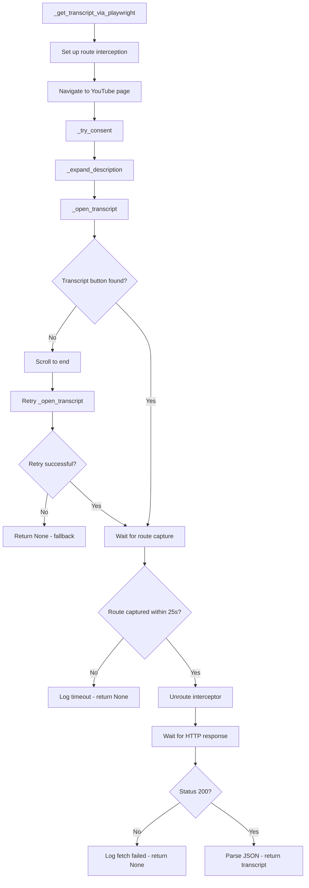
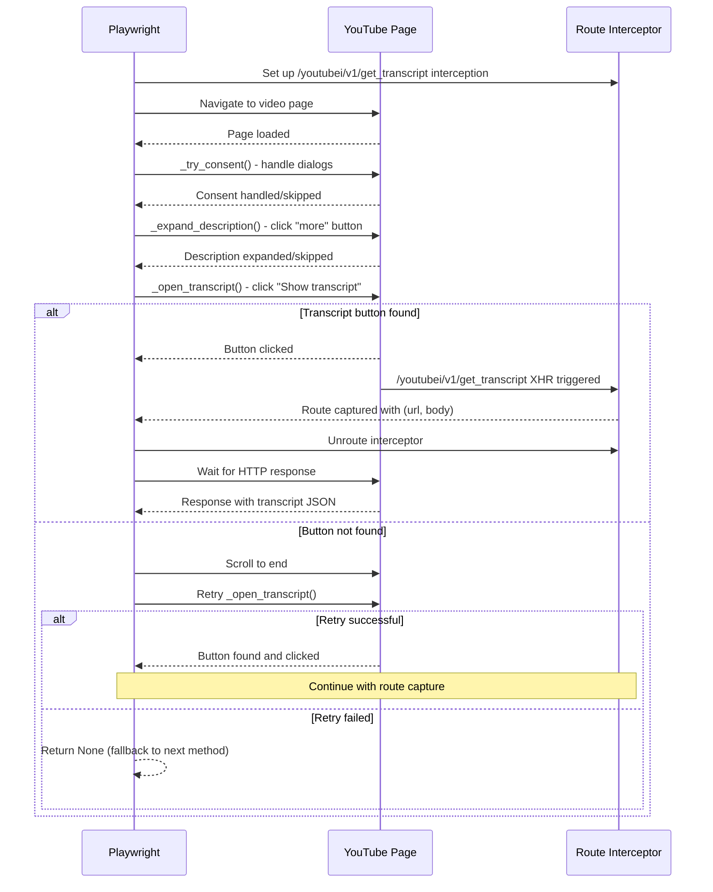

# Design Document

## Overview

This design enhances the existing Playwright transcript pipeline with DOM interaction capabilities to discover transcript buttons that are hidden behind collapsed descriptions on YouTube videos. The solution implements helper functions for consent handling, description expansion, and transcript button discovery while maintaining the existing network interception approach and preserving all proxy/cookie behavior.

The design focuses on robust selector strategies, graceful degradation, and minimal impact on existing functionality while significantly improving transcript discovery success rates.

## Architecture

### Enhanced Playwright Transcript Flow



### DOM Interaction Helper Flow



## Components and Interfaces

### Enhanced TranscriptService Methods

#### New DOM Helper Methods
```python
async def _try_consent(self, page) -> None:
    """Handle common consent dialogs if present."""
    consent_selectors = [
        'button:has-text("Accept all")',
        'button:has-text("I agree")',
        'button[aria-label*="accept" i]',
        'tp-yt-paper-button:has-text("Accept")'
    ]
    
    for selector in consent_selectors:
        try:
            if await page.locator(selector).is_visible(timeout=2000):
                await page.locator(selector).click(timeout=5000)
                await page.wait_for_timeout(1000)  # Wait for dialog dismissal
                self.logger.info("youtubei_dom: handled consent dialog")
                return
        except Exception:
            continue  # Try next selector
    
    # No consent dialog found or all attempts failed - continue

async def _expand_description(self, page) -> None:
    """Expand collapsed description using resilient selectors."""
    expansion_selectors = [
        'ytd-text-inline-expander tp-yt-paper-button.more-button',
        'tp-yt-paper-button:has-text("more")',
        'button[aria-label*="more"]'
    ]
    
    for selector in expansion_selectors:
        try:
            if await page.locator(selector).is_visible(timeout=3000):
                await page.locator(selector).click(timeout=5000)
                await page.wait_for_timeout(500)  # Wait for expansion
                self.logger.info(f"youtubei_dom: expanded description via {selector}")
                return
        except Exception:
            continue  # Try next selector
    
    # No expander found - description may already be expanded or not present

async def _open_transcript(self, page) -> bool:
    """Click 'Show transcript' button using robust selectors."""
    transcript_selectors = [
        'tp-yt-paper-button:has-text("Show transcript")',
        'button:has-text("Show transcript")',
        'button[aria-label*="transcript" i]',
        'tp-yt-paper-button[aria-label*="transcript" i]',
        'ytd-transcript-search-panel-renderer tp-yt-paper-button'  # Fallback
    ]
    
    for selector in transcript_selectors:
        try:
            if await page.locator(selector).is_visible(timeout=3000):
                await page.locator(selector).click(timeout=5000)
                self.logger.info(f"youtubei_dom: clicked transcript launcher ({selector})")
                return True
        except Exception:
            continue  # Try next selector
    
    return False  # No transcript button found
```

#### Enhanced Main Method
```python
async def _get_transcript_via_playwright(self, video_id: str) -> list[dict] | None:
    """Enhanced Playwright transcript extraction with DOM interaction."""
    
    # Set up route interception BEFORE any DOM interactions
    transcript_future = asyncio.Future()
    
    async def handle_transcript_route(route):
        url = route.request.url
        if '/youtubei/v1/get_transcript' in url:
            response = await route.fetch()
            body = await response.text()
            transcript_future.set_result((url, body))
        await route.continue_()
    
    await page.route('**/youtubei/v1/get_transcript*', handle_transcript_route)
    
    try:
        # Navigate to video page
        await page.goto(f"https://www.youtube.com/watch?v={video_id}&hl=en")
        await page.wait_for_load_state('domcontentloaded')
        
        # DOM interaction sequence
        await self._try_consent(page)
        await self._expand_description(page)
        
        # Try to open transcript
        if not await self._open_transcript(page):
            # Scroll and retry once
            await page.evaluate('window.scrollTo(0, document.body.scrollHeight)')
            await page.wait_for_timeout(1000)
            
            if not await self._open_transcript(page):
                self.logger.warning("youtubei_dom: transcript button not found after retry")
                return None
        
        # Wait for route capture
        try:
            url, body = await asyncio.wait_for(transcript_future, timeout=25.0)
            self.logger.info(f"youtubei_route_captured url={url}")
        except asyncio.TimeoutError:
            self.logger.warning("youtubei_dom: route interception timeout")
            return None
        finally:
            await page.unroute('**/youtubei/v1/get_transcript*')
        
        # Wait for HTTP response and validate
        try:
            response = await page.wait_for_response(
                lambda r: '/youtubei/v1/get_transcript' in r.url,
                timeout=6000
            )
            
            if response.status != 200:
                self.logger.warning(f"youtubei_direct_fetch_failed status={response.status}")
                return None
                
            # Parse and return transcript JSON
            json_data = await response.json()
            return self._extract_cues_from_youtubei(json_data)
            
        except Exception as e:
            self.logger.warning(f"youtubei_dom: response handling failed: {e}")
            return None
            
    except Exception as e:
        self.logger.warning(f"youtubei_dom: navigation/interaction failed: {e}")
        return None
```

### Selector Strategy Design

#### Resilient Selector Hierarchy
```python
class SelectorStrategy:
    """Hierarchical selector strategy for robust DOM element discovery."""
    
    CONSENT_SELECTORS = [
        'button:has-text("Accept all")',      # Most common
        'button:has-text("I agree")',         # Alternative text
        'button[aria-label*="accept" i]',     # Accessibility fallback
        'tp-yt-paper-button:has-text("Accept")'  # YouTube-specific
    ]
    
    DESCRIPTION_EXPANDERS = [
        'ytd-text-inline-expander tp-yt-paper-button.more-button',  # Specific YouTube component
        'tp-yt-paper-button:has-text("more")',                      # Text-based fallback
        'button[aria-label*="more"]'                                # Accessibility fallback
    ]
    
    TRANSCRIPT_BUTTONS = [
        'tp-yt-paper-button:has-text("Show transcript")',           # Primary YouTube button
        'button:has-text("Show transcript")',                       # Generic button fallback
        'button[aria-label*="transcript" i]',                       # Accessibility (case-insensitive)
        'tp-yt-paper-button[aria-label*="transcript" i]',          # YouTube accessibility
        'ytd-transcript-search-panel-renderer tp-yt-paper-button'   # Deep fallback
    ]
    
    @staticmethod
    async def find_and_click(page, selectors: list[str], operation_name: str) -> bool:
        """Generic method to try selectors in order until one succeeds."""
        for selector in selectors:
            try:
                if await page.locator(selector).is_visible(timeout=3000):
                    await page.locator(selector).click(timeout=5000)
                    return True
            except Exception:
                continue
        return False
```

### Route Interception Design

#### Future-Based Route Capture
```python
class RouteInterceptor:
    """Manages route interception with Future-based result handling."""
    
    def __init__(self):
        self.transcript_future = None
        self.route_handler = None
    
    async def setup_interception(self, page):
        """Set up route interception before DOM interactions."""
        self.transcript_future = asyncio.Future()
        
        async def handle_route(route):
            url = route.request.url
            if '/youtubei/v1/get_transcript' in url:
                try:
                    response = await route.fetch()
                    body = await response.text()
                    if not self.transcript_future.done():
                        self.transcript_future.set_result((url, body))
                except Exception as e:
                    if not self.transcript_future.done():
                        self.transcript_future.set_exception(e)
            await route.continue_()
        
        self.route_handler = handle_route
        await page.route('**/youtubei/v1/get_transcript*', handle_route)
    
    async def wait_for_capture(self, timeout: float = 25.0) -> tuple[str, str] | None:
        """Wait for route capture with timeout."""
        try:
            return await asyncio.wait_for(self.transcript_future, timeout=timeout)
        except asyncio.TimeoutError:
            return None
    
    async def cleanup(self, page):
        """Clean up route interception."""
        if self.route_handler:
            await page.unroute('**/youtubei/v1/get_transcript*')
            self.route_handler = None
```

## Data Models

### DOM Interaction Result
```python
@dataclass
class DOMInteractionResult:
    """Result of DOM interaction operations."""
    consent_handled: bool
    description_expanded: bool
    transcript_button_found: bool
    retry_attempted: bool
    route_captured: bool
    response_valid: bool
    error_type: Optional[str] = None
    
    def is_successful(self) -> bool:
        """Check if DOM interactions led to successful transcript capture."""
        return self.route_captured and self.response_valid
```

### Selector Configuration
```python
@dataclass
class SelectorConfig:
    """Configuration for DOM element selectors."""
    consent_timeout_ms: int = 2000
    expansion_timeout_ms: int = 3000
    transcript_timeout_ms: int = 3000
    click_timeout_ms: int = 5000
    scroll_wait_ms: int = 1000
    expansion_wait_ms: int = 500
    
    route_capture_timeout_s: float = 25.0
    response_wait_timeout_ms: int = 6000
```

### Enhanced Error Types
```python
class DOMInteractionError(Exception):
    """Base class for DOM interaction errors."""
    pass

class ConsentHandlingError(DOMInteractionError):
    """Error during consent dialog handling."""
    pass

class DescriptionExpansionError(DOMInteractionError):
    """Error during description expansion."""
    pass

class TranscriptButtonError(DOMInteractionError):
    """Error finding or clicking transcript button."""
    pass

class RouteInterceptionError(DOMInteractionError):
    """Error during route interception."""
    pass
```

## Error Handling

### Graceful Degradation Strategy

```python
class GracefulDOMHandler:
    """Handles DOM interactions with graceful degradation."""
    
    async def safe_dom_operation(self, operation_func, operation_name: str, *args, **kwargs):
        """Execute DOM operation with error handling and logging."""
        try:
            return await operation_func(*args, **kwargs)
        except Exception as e:
            self.logger.warning(f"youtubei_dom: {operation_name}_failed: {str(e)}")
            return None  # Continue with next operation
    
    async def execute_dom_sequence(self, page, video_id: str) -> bool:
        """Execute full DOM interaction sequence with graceful failures."""
        
        # Each operation can fail without breaking the sequence
        await self.safe_dom_operation(self._try_consent, "consent_handling", page)
        await self.safe_dom_operation(self._expand_description, "description_expansion", page)
        
        # Transcript button discovery is critical - try with retry
        button_found = await self.safe_dom_operation(self._open_transcript, "transcript_discovery", page)
        
        if not button_found:
            # Scroll and retry once
            await self.safe_dom_operation(page.evaluate, "scroll_to_end", 
                                        'window.scrollTo(0, document.body.scrollHeight)')
            await page.wait_for_timeout(1000)
            button_found = await self.safe_dom_operation(self._open_transcript, "transcript_retry", page)
        
        return bool(button_found)
```

### Timeout Management

```python
class TimeoutManager:
    """Manages timeouts for different DOM operations."""
    
    TIMEOUTS = {
        'consent_visibility': 2000,      # Quick check for consent dialogs
        'element_visibility': 3000,      # Standard element visibility check
        'click_operation': 5000,         # Click operations
        'route_capture': 25000,          # Route interception wait
        'response_wait': 6000,           # HTTP response wait
        'scroll_settle': 1000,           # Wait after scrolling
        'expansion_settle': 500          # Wait after description expansion
    }
    
    @classmethod
    def get_timeout(cls, operation: str) -> int:
        """Get timeout for specific operation."""
        return cls.TIMEOUTS.get(operation, 5000)  # Default 5s
```

## Testing Strategy

### Unit Tests

#### DOM Helper Method Tests
```python
class TestDOMHelpers:
    """Test DOM interaction helper methods."""
    
    async def test_try_consent_success(self, mock_page):
        """Test successful consent dialog handling."""
        mock_page.locator.return_value.is_visible.return_value = True
        mock_page.locator.return_value.click = AsyncMock()
        
        service = TranscriptService()
        await service._try_consent(mock_page)
        
        mock_page.locator.return_value.click.assert_called_once()
    
    async def test_expand_description_with_expander(self, mock_page):
        """Test description expansion when expander exists."""
        mock_page.locator.return_value.is_visible.return_value = True
        mock_page.locator.return_value.click = AsyncMock()
        
        service = TranscriptService()
        await service._expand_description(mock_page)
        
        mock_page.locator.return_value.click.assert_called_once()
    
    async def test_open_transcript_button_found(self, mock_page):
        """Test transcript button discovery and clicking."""
        mock_page.locator.return_value.is_visible.return_value = True
        mock_page.locator.return_value.click = AsyncMock()
        
        service = TranscriptService()
        result = await service._open_transcript(mock_page)
        
        assert result is True
        mock_page.locator.return_value.click.assert_called_once()
    
    async def test_open_transcript_not_found(self, mock_page):
        """Test transcript button not found scenario."""
        mock_page.locator.return_value.is_visible.return_value = False
        
        service = TranscriptService()
        result = await service._open_transcript(mock_page)
        
        assert result is False
```

#### Route Interception Tests
```python
class TestRouteInterception:
    """Test route interception functionality."""
    
    async def test_route_capture_success(self, mock_page):
        """Test successful route capture."""
        mock_response = Mock()
        mock_response.text.return_value = '{"transcript": "data"}'
        
        # Mock route handler setup
        captured_handler = None
        async def mock_route(pattern, handler):
            nonlocal captured_handler
            captured_handler = handler
        
        mock_page.route = mock_route
        
        service = TranscriptService()
        # Test route setup and capture logic
        
    async def test_route_capture_timeout(self, mock_page):
        """Test route capture timeout handling."""
        service = TranscriptService()
        
        # Mock timeout scenario
        with patch('asyncio.wait_for', side_effect=asyncio.TimeoutError):
            result = await service._get_transcript_via_playwright("test_video")
            assert result is None
```

#### Failure Path Tests
```python
class TestFailurePaths:
    """Test various failure scenarios."""
    
    async def test_no_consent_dialog(self, mock_page):
        """Test behavior when no consent dialog is present."""
        mock_page.locator.return_value.is_visible.return_value = False
        
        service = TranscriptService()
        # Should not raise exception
        await service._try_consent(mock_page)
    
    async def test_no_description_expander(self, mock_page):
        """Test behavior when description is already expanded."""
        mock_page.locator.return_value.is_visible.return_value = False
        
        service = TranscriptService()
        # Should not raise exception
        await service._expand_description(mock_page)
    
    async def test_transcript_button_timeout(self, mock_page):
        """Test timeout when looking for transcript button."""
        mock_page.locator.return_value.is_visible.side_effect = TimeoutError()
        
        service = TranscriptService()
        result = await service._open_transcript(mock_page)
        assert result is False
```

### Integration Tests

#### End-to-End DOM Flow Tests
```python
class TestDOMIntegration:
    """Test complete DOM interaction flow."""
    
    async def test_full_dom_sequence_success(self, mock_playwright):
        """Test complete DOM sequence with successful transcript extraction."""
        # Mock successful DOM interactions
        # Mock successful route capture
        # Verify transcript data returned
        
    async def test_dom_sequence_with_retry(self, mock_playwright):
        """Test DOM sequence with scroll-and-retry logic."""
        # Mock initial button not found
        # Mock successful retry after scroll
        # Verify transcript extraction succeeds
    
    async def test_dom_sequence_complete_failure(self, mock_playwright):
        """Test DOM sequence when all interactions fail."""
        # Mock all DOM interactions failing
        # Verify graceful return of None
        # Verify fallback methods are called
```

#### Real Video Tests
```python
class TestRealVideoIntegration:
    """Test with real YouTube videos (requires network)."""
    
    @pytest.mark.integration
    async def test_video_rNxC16mlO60(self):
        """Test with specific video ID rNxC16mlO60."""
        service = TranscriptService()
        result = await service._get_transcript_via_playwright("rNxC16mlO60")
        
        # Should succeed and return transcript data
        assert result is not None
        assert len(result) > 0
        assert all('text' in segment for segment in result)
    
    @pytest.mark.integration  
    async def test_video_with_collapsed_description(self):
        """Test with video known to have collapsed description."""
        # Test video where transcript button is hidden
        # Verify description expansion works
        # Verify transcript extraction succeeds
```

## Deployment Considerations

### No Additional Dependencies

The DOM interaction enhancements use only existing Playwright functionality, so no new dependencies are required. The existing `playwright==1.46.0` dependency is sufficient.

### Configuration Updates

#### Environment Variables (Optional)
```bash
# Optional: Enable/disable DOM interactions for rollback
ENABLE_DOM_TRANSCRIPT_DISCOVERY=true

# Optional: Adjust timeouts for different environments
DOM_INTERACTION_TIMEOUT_MS=25000
DOM_RESPONSE_TIMEOUT_MS=6000
```

#### Feature Flag Support
```python
# Simple feature flag for rollback capability
ENABLE_DOM_INTERACTIONS = os.getenv("ENABLE_DOM_TRANSCRIPT_DISCOVERY", "true").lower() == "true"

async def _get_transcript_via_playwright(self, video_id: str) -> list[dict] | None:
    if not ENABLE_DOM_INTERACTIONS:
        # Use original Playwright implementation without DOM interactions
        return await self._get_transcript_via_playwright_original(video_id)
    
    # Use enhanced DOM interaction implementation
    return await self._get_transcript_via_playwright_enhanced(video_id)
```

### Monitoring and Observability

#### Key Metrics to Track
- DOM interaction success rates (consent, expansion, transcript button discovery)
- Route interception success rates
- Retry attempt frequency
- DOM operation timing metrics

#### Enhanced Logging
```python
# Structured logging for DOM operations
self.logger.info("youtubei_dom: expanded description via ytd-text-inline-expander tp-yt-paper-button.more-button")
self.logger.info("youtubei_dom: clicked transcript launcher (tp-yt-paper-button:has-text('Show transcript'))")
self.logger.info("youtubei_route_captured url=https://www.youtube.com/youtubei/v1/get_transcript")
self.logger.warning("youtubei_dom: transcript button not found after retry")
self.logger.warning("youtubei_direct_fetch_failed status=404")
```

### Rollback Strategy

#### Simple Rollback Mechanism
```python
# Environment variable to disable DOM interactions
if os.getenv("DISABLE_DOM_INTERACTIONS", "false").lower() == "true":
    # Skip DOM interactions, use original network-only approach
    return await self._original_playwright_method(video_id)
```

#### Gradual Rollout Support
```python
# Percentage-based rollout
DOM_ROLLOUT_PERCENTAGE = int(os.getenv("DOM_ROLLOUT_PERCENTAGE", "100"))

if random.randint(1, 100) <= DOM_ROLLOUT_PERCENTAGE:
    # Use DOM-enhanced version
    return await self._get_transcript_via_playwright_enhanced(video_id)
else:
    # Use original version
    return await self._get_transcript_via_playwright_original(video_id)
```

The design ensures that DOM interaction enhancements can be deployed safely with comprehensive error handling, graceful degradation, and the ability to rollback quickly if needed. The enhancements maintain full compatibility with existing proxy/cookie behavior and integrate seamlessly with the current Playwright pipeline.