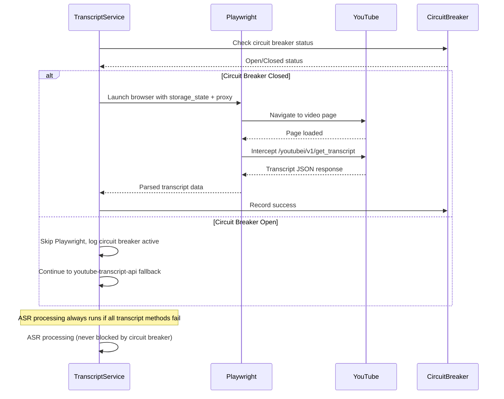

# Design Document

## Overview

This design implements a Playwright-first transcript pipeline that intercepts YouTube's internal `/youtubei/v1/get_transcript` API calls to extract transcript data directly from the source. The solution replaces the current primary transcript extraction method while maintaining existing fallbacks and improving reliability through proper session management, mandatory proxy enforcement in production, and decoupled circuit breaker behavior.

The design ensures high-quality transcript extraction by leveraging YouTube's internal API while maintaining backward compatibility and robust error handling.

## Architecture

### High-Level Transcript Pipeline Flow

```mermaid
graph TD
    A[get_transcript] --> B[_get_transcript_via_playwright]
    B --> C{Storage State Exists?}
    C -->|No| D[Log Warning + Continue to Fallback]
    C -->|Yes| E[Launch Playwright with Proxy]
    E --> F{Proxy Available?}
    F -->|No + Production| G[Abort with Error]
    F -->|No + Development| H[Log Warning + Continue Direct]
    F -->|Yes| I[Create Browser Context]
    H --> I
    I --> J[Navigate to YouTube Video]
    J --> K[Intercept /youtubei/v1/get_transcript]
    K --> L{Transcript Captured?}
    L -->|Yes| M[Parse JSON + Return]
    L -->|No| N[Try Secondary URL]
    N --> O{Secondary Success?}
    O -->|Yes| M
    O -->|No| P[Fallback to youtube-transcript-api]
    D --> P
    G --> P
    P --> Q[Fallback to timedtext]
    Q --> R[ASR Processing (Always Available)]
    R --> S[Return Result]
    M --> S
```

### Playwright Network Interception Flow



## Components and Interfaces

### Enhanced TranscriptService Class

#### New Methods
```python
async def _get_transcript_via_playwright(self, video_id: str) -> list[dict] | None:
    """Primary transcript extraction using Playwright network interception."""
    
def _extract_cues_from_youtubei(self, data: dict) -> list[dict]:
    """Parse YouTubei JSON response to extract transcript cues."""
    
def _get_youtube_urls(self, video_id: str) -> list[str]:
    """Return ordered list of YouTube URLs to try."""
```

#### Modified Methods
```python
def get_transcript(self, video_id: str, language: str = "en", 
                  user_cookies=None, playwright_cookies=None, 
                  user_id: Optional[int] = None) -> str:
    """Enhanced with Playwright-first pipeline."""
```

### Playwright Configuration (Integrated into TranscriptService)

Configuration management will be integrated directly into the TranscriptService class to keep the surface area small for MVP. Browser context configuration, storage state path resolution, and environment validation will be handled as private methods within the existing service.

### Enhanced ProxyManager Integration

```python
class ProxyManager:
    def playwright_proxy(self) -> dict | None:
        """Return Playwright-compatible proxy configuration."""
        proxy_url = self.get_proxy_url()
        if not proxy_url:
            return None
            
        from urllib.parse import urlparse
        u = urlparse(proxy_url)
        auth = u.username, u.password
        return {
            "server": f"{u.scheme}://{u.hostname}:{u.port}",
            **({"username": auth[0], "password": auth[1]} if all(auth) else {})
        }
        
    def is_production_environment(self) -> bool:
        """Detect if running in production environment."""
        return os.getenv('ENVIRONMENT') == 'production' or os.getenv('AWS_REGION') is not None
```

### YouTubei JSON Parsing (Integrated into TranscriptService)

JSON parsing will be handled by the `_extract_cues_from_youtubei` private method within TranscriptService. For MVP, this will extract basic {text, start, duration} format without filtering noise markers. Noise filtering can be added later behind a feature flag.

## Data Models

### Playwright Browser Configuration
```python
@dataclass
class PlaywrightConfig:
    storage_state_path: str
    proxy_config: Optional[dict]
    user_agent: str
    headless: bool = True
    timeout: int = 120000  # 2 minutes
    
    def to_context_kwargs(self) -> dict:
        """Convert to Playwright browser context kwargs."""
        return {
            "storage_state": self.storage_state_path,
            "user_agent": self.user_agent,
            "headless": self.headless,
            **({"proxy": self.proxy_config} if self.proxy_config else {})
        }
```

### Transcript Extraction Result
```python
@dataclass
class TranscriptExtractionResult:
    success: bool
    method: str  # "playwright", "youtube_api", "timedtext", "asr"
    transcript_data: list[dict]
    duration_ms: int
    error_type: Optional[str] = None
    error_message: Optional[str] = None
    
    def to_text(self) -> str:
        """Convert transcript segments to plain text."""
        return " ".join(segment["text"] for segment in self.transcript_data)
```

### YouTubei Response Structure
```python
# Expected YouTubei JSON structure patterns
YOUTUBEI_TRANSCRIPT_PATHS = [
    ["actions", 0, "updateEngagementPanelAction", "content", "transcriptRenderer", "body"],
    ["contents", "transcriptSearchPanelRenderer", "body"],
    ["response", "actions", 0, "updateEngagementPanelAction", "content"]
]

# Cue segment structure
CUES_SEGMENT_STRUCTURE = {
    "text": str,           # Transcript text
    "start": float,       # Start time in seconds
    "duration": float     # Duration in seconds
}
```

## Error Handling

### Error Classification System

```python
class PlaywrightErrorClassifier:
    ERROR_TYPES = {
        "authentication_missing": "Storage state file not found",
        "browser_launch_failure": "Failed to launch Chromium browser",
        "navigation_timeout": "Page navigation exceeded timeout",
        "response_parsing_error": "Failed to parse YouTubei JSON response",
        "proxy_connection_error": "Proxy connection failed",
        "network_timeout": "Network request timed out",
        "storage_state_invalid": "Storage state file corrupted or invalid"
    }
    
    @classmethod
    def classify_error(cls, exception: Exception) -> str:
        """Classify exception into error type category."""
```

### Circuit Breaker Decoupling

```python
class DecoupledCircuitBreaker:
    """Circuit breaker that only affects Playwright, not ASR processing."""
    
    def __init__(self):
        self.playwright_failures = 0
        self.last_failure_time = None
        self.FAILURE_THRESHOLD = 3
        self.RECOVERY_TIME_SECONDS = 600  # 10 minutes
        
    def is_playwright_blocked(self) -> bool:
        """Check if Playwright operations should be skipped."""
        
    def record_playwright_failure(self) -> None:
        """Record Playwright failure (does not affect ASR)."""
        
    def record_playwright_success(self) -> None:
        """Reset Playwright failure count."""
        
    def should_allow_asr(self) -> bool:
        """ASR is always allowed regardless of Playwright state."""
        return True
```

### Production Environment Validation

Production validation will fail fast on missing proxy configuration before launching the browser:

```python
def _validate_production_requirements(self) -> None:
    """Validate that production requirements are met before Playwright launch."""
    if self.proxy_manager.is_production_environment():
        if not self.proxy_manager.playwright_proxy():
            raise ProductionConfigError(
                "Proxy configuration required in production environment. "
                "Check AWS Secrets Manager proxy configuration."
            )
```

### Timeout Strategy

Playwright operations will wait up to 15 seconds for `/youtubei/v1/get_transcript` XHR after page load, then try m.youtube.com format, then bail to next fallback method. This keeps operations bounded and prevents hanging.

### Fallback Order

The explicit fallback order is: Playwright → youtube-transcript-api → timedtext → ASR. ASR always runs if all transcript methods fail, regardless of circuit breaker state.

## Testing Strategy

### Unit Tests

#### Playwright Configuration Tests
```python
def test_playwright_config_with_proxy():
    """Test Playwright configuration includes proxy settings."""
    
def test_playwright_config_without_proxy_dev():
    """Test development environment allows no proxy with warning."""
    
def test_playwright_config_without_proxy_production():
    """Test production environment requires proxy configuration."""
```

#### JSON Parsing Tests
```python
def test_youtubei_json_parsing_standard_format():
    """Test parsing of standard YouTubei transcript JSON."""
    
def test_youtubei_json_parsing_alternative_formats():
    """Test parsing of various YouTubei response structures."""
    
def test_youtubei_json_parsing_malformed_data():
    """Test graceful handling of malformed JSON responses."""
```

#### Circuit Breaker Decoupling Tests
```python
def test_circuit_breaker_blocks_playwright_only():
    """Test that active circuit breaker only affects Playwright."""
    
def test_asr_always_available():
    """Test that ASR processing is never blocked by circuit breaker."""
    
def test_circuit_breaker_reset_on_success():
    """Test that Playwright success resets circuit breaker."""
```

### Integration Tests

#### End-to-End Playwright Flow
```python
def test_playwright_transcript_extraction_success():
    """Test complete Playwright transcript extraction flow."""
    
def test_playwright_fallback_to_youtube_api():
    """Test fallback when Playwright fails."""
    
def test_storage_state_missing_fallback():
    """Test behavior when storage_state file is missing."""
```

#### Network Interception Tests
```python
def test_youtubei_request_interception():
    """Test interception of /youtubei/v1/get_transcript requests."""
    
def test_multiple_url_format_attempts():
    """Test trying both www.youtube.com and m.youtube.com URLs."""
    
def test_proxy_enforcement_in_production():
    """Test that production environment enforces proxy usage."""
```

### Performance Tests

#### Playwright Performance Benchmarks
```python
# Expected Performance Targets
PLAYWRIGHT_BROWSER_LAUNCH_MAX_MS = 5000
PLAYWRIGHT_PAGE_NAVIGATION_MAX_MS = 15000
PLAYWRIGHT_TRANSCRIPT_EXTRACTION_MAX_MS = 30000
YOUTUBEI_JSON_PARSING_MAX_MS = 100
```

#### Performance Monitoring Tests
```python
def test_playwright_performance_logging():
    """Test that performance metrics are logged correctly."""
    
def test_timeout_handling_performance():
    """Test that timeouts are handled within expected time bounds."""
```

## Deployment Considerations

### Docker Configuration Updates

#### Dockerfile Changes
```dockerfile
# Add Playwright dependency
RUN pip install playwright==1.46.0

# Install Playwright browsers (Chromium only)
RUN python -m playwright install --with-deps chromium

# Ensure cookies directory exists at runtime
ENV COOKIE_DIR=/app/cookies
RUN mkdir -p ${COOKIE_DIR}

# Set Playwright environment variables
ENV PLAYWRIGHT_BROWSERS_PATH=/ms-playwright
ENV PLAYWRIGHT_SKIP_BROWSER_DOWNLOAD=1
```

#### Requirements.txt Updates
```txt
# Add to requirements.txt
playwright==1.46.0
```

### Environment Configuration

#### Required Environment Variables
```bash
# Cookie storage location
COOKIE_DIR=/app/cookies

# Environment detection for proxy enforcement
ENVIRONMENT=production  # or development

# Playwright configuration
PLAYWRIGHT_HEADLESS=true
PLAYWRIGHT_TIMEOUT_MS=120000
```

#### AWS Secrets Manager Integration
```json
{
  "proxy_config": {
    "server": "http://pr.oxylabs.io:7777",
    "username": "customer-username",
    "password": "customer-password"
  }
}
```

### Cookie Generator Updates

#### Enhanced cookie_generator.py
```python
import os
from pathlib import Path

# Use COOKIE_DIR environment variable
COOKIE_DIR = Path(os.getenv("COOKIE_DIR", "/app/cookies"))
STORAGE_STATE = COOKIE_DIR / "youtube_session.json"

async def save_storage_state(context):
    """Save storage state to correct location."""
    await context.storage_state(path=str(STORAGE_STATE))
    print(f"[cookie_generator] wrote storage_state at {STORAGE_STATE}")
```

### Monitoring and Observability

#### Key Metrics to Track
- Playwright transcript extraction success rate
- Average Playwright operation duration
- Circuit breaker activation frequency
- Storage state file availability
- Proxy connection success rate

#### Simple Performance Logging
```python
# Keep performance logging simple for MVP
logging.info(f"performance_metric operation=transcript_playwright success=True duration_ms={duration} video_id={video_id}")
logging.info(f"performance_metric operation=transcript_youtube_api success=False duration_ms={duration} video_id={video_id}")
```

#### Logging Configuration
```python
# Playwright operation logging
logging.info(f"[playwright] launching browser: proxy={masked_proxy}, storage_state={storage_path}, ua={user_agent}")
logging.info(f"[playwright] transcript captured: video_id={video_id}, segments={len(segments)}, duration_ms={duration}")
logging.warning(f"[playwright] storage_state missing at {storage_path} - Run: python cookie_generator.py")

# Performance metrics logging
logging.info(f"performance_metric operation=transcript_playwright success=True duration_ms={duration} video_id={video_id}")
```

### Rollback Strategy

#### Feature Flags for Safe Deployment
```python
# Environment-based feature flags
ENABLE_PLAYWRIGHT_PRIMARY = os.getenv("ENABLE_PLAYWRIGHT_PRIMARY", "true").lower() == "true"
PLAYWRIGHT_CIRCUIT_BREAKER_ENABLED = os.getenv("PLAYWRIGHT_CIRCUIT_BREAKER_ENABLED", "true").lower() == "true"

# Rollback to previous behavior
if not ENABLE_PLAYWRIGHT_PRIMARY:
    # Use youtube-transcript-api as primary method
    return self._get_transcript_via_youtube_api(video_id, language)
```

#### Simple Rollback Strategy
Deploy Playwright as primary method with a single kill-switch environment variable for rollback:
```bash
ENABLE_PLAYWRIGHT_PRIMARY=false  # Rollback to youtube-transcript-api first
```

The design ensures that the Playwright-first transcript pipeline can be deployed safely with comprehensive monitoring, robust error handling, and the ability to rollback quickly if needed.