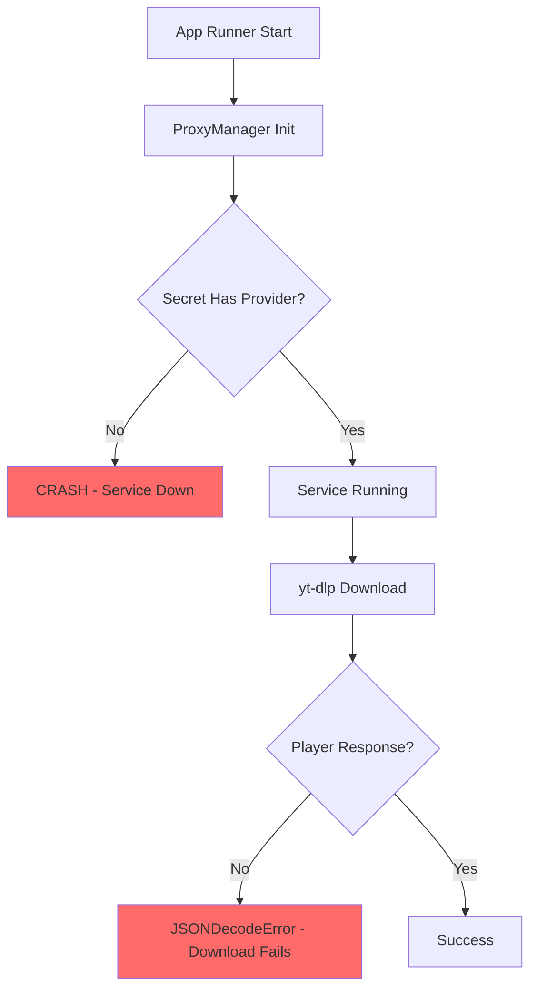
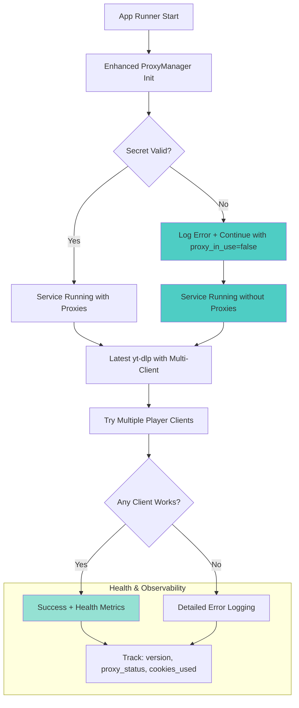

# Design Document

## Overview

This design addresses critical production failures in the TL;DW backend that are causing complete service outages. The solution provides a comprehensive fix for ProxyManager crashes, yt-dlp extraction failures, deployment issues, and system observability problems while maintaining backwards compatibility.

The core problems being solved are:
1. **ProxyManager startup crashes** due to missing AWS Secrets Manager "provider" field
2. **yt-dlp extraction failures** from outdated versions and missing player client configurations
3. **Deployment cache issues** preventing proper App Runner service restarts
4. **Missing observability** for debugging production issues
5. **Code duplication and inconsistent environment variables** affecting maintainability

## Architecture

### Current Failure Flow


### Enhanced Resilient Flow


## Components and Interfaces

### 1. Resilient ProxyManager Enhancement

#### Graceful Secret Handling
The ProxyManager will be enhanced to handle missing or malformed secrets:

```python
class ProxyManager:
    def __init__(self):
        self.in_use = False
        self.proxy_pool = []
        
        try:
            secret_data = self._fetch_secret()
            if self._validate_secret_schema(secret_data):
                self._initialize_proxies(secret_data)
                self.in_use = True
            else:
                logging.warning("Invalid proxy secret schema, continuing without proxies")
        except Exception as e:
            logging.error(f"Proxy initialization failed: {e}, continuing without proxies")
    
    def _validate_secret_schema(self, secret_data: dict) -> bool:
        required_fields = ["provider", "host", "port", "username", "password", "protocol"]
        missing_fields = [field for field in required_fields if field not in secret_data]
        
        if missing_fields:
            logging.warning(f"Proxy secret missing fields: {missing_fields}")
            return False
        return True
```

**Key Changes:**
- Graceful degradation when secrets are malformed
- Comprehensive field validation before proxy initialization
- Clear logging without exposing sensitive data
- Service continues running even with proxy failures

### 2. Enhanced Dockerfile with yt-dlp Version Management

#### Build-time Version Control
The Dockerfile will support flexible yt-dlp version management:

```dockerfile
# Add version management for yt-dlp
ARG YTDLP_VERSION=latest

# Install yt-dlp with version control
RUN if [ "$YTDLP_VERSION" = "latest" ]; then \
        pip install --no-cache-dir -U yt-dlp; \
    else \
        pip install --no-cache-dir yt-dlp=="$YTDLP_VERSION"; \
    fi

# Log version for debugging and health checks
RUN python -c "import yt_dlp; print('yt-dlp version:', yt_dlp.version.__version__)"

# Verify ffmpeg is available
RUN ffmpeg -version || echo "FFmpeg not found - downloads may fail"
```

**Benefits:**
- Flexible version pinning for stability or latest features
- Build-time version logging for debugging
- Health check preparation with version information
- FFmpeg validation during build

### 3. Hardened yt-dlp Configuration

#### Multi-Client Extraction Strategy
The yt-dlp configuration will use multiple player clients for maximum compatibility:

```python
def get_enhanced_ydl_opts(proxy_url: str = None, cookiefile: str = None) -> dict:
    base_opts = {
        "quiet": True,
        "noplaylist": True,
        "extractaudio": True,
        "format": "bestaudio[ext=m4a]/bestaudio/best",
        "ffmpeg_location": "/usr/bin",
        "extractor_args": {
            "youtube": {
                "player_client": ["android", "web", "web_safari"]  # Multiple clients for resilience
            }
        },
        "http_headers": {
            "User-Agent": "Mozilla/5.0 (Linux; Android 10; SM-G973F) AppleWebKit/537.36",
            "Accept-Language": "en-US,en;q=0.9"
        },
        # Network resilience settings
        "retries": 2,
        "socket_timeout": 10,
        "nocheckcertificate": True
    }
    
    if proxy_url:
        base_opts["proxy"] = proxy_url
    
    if cookiefile and os.path.exists(cookiefile):
        base_opts["cookiefile"] = cookiefile
    
    return base_opts
```

**Design Decisions:**
- Multiple player clients provide fallback options when one fails
- Android client often works when web clients are blocked
- Enhanced headers reduce bot detection
- Conditional proxy and cookie configuration

### 4. Comprehensive Health Diagnostics

#### Enhanced Health Endpoints
New health endpoints will provide detailed system diagnostics:

```python
@app.route('/healthz')
def health_check():
    """Enhanced health check with gated diagnostics"""
    # Basic health check always available
    basic_health = {"status": "healthy"}
    
    # Detailed diagnostics only when explicitly enabled
    if os.getenv('EXPOSE_HEALTH_DIAGNOSTICS', 'false').lower() == 'true':
        try:
            import yt_dlp
            yt_dlp_version = yt_dlp.version.__version__
        except:
            yt_dlp_version = "unknown"
        
        # Check ffmpeg availability (boolean only, no path exposure)
        ffmpeg_available = os.path.exists("/usr/bin/ffmpeg")
        
        # Get proxy status from ProxyManager
        proxy_in_use = getattr(app.proxy_manager, 'in_use', False)
        
        # Get last download metadata (without sensitive data)
        last_download_meta = getattr(app, 'last_download_meta', {})
        
        basic_health.update({
            "yt_dlp_version": yt_dlp_version,
            "ffmpeg_available": ffmpeg_available,
            "proxy_in_use": proxy_in_use,
            "last_download_used_cookies": last_download_meta.get("used_cookies", False),
            "last_download_client": last_download_meta.get("client_used", "unknown"),
            "timestamp": datetime.utcnow().isoformat()
        })
    
    return basic_health

@app.route('/health/yt-dlp')
def yt_dlp_health():
    """Specific yt-dlp diagnostics"""
    try:
        import yt_dlp
        return {
            "version": yt_dlp.version.__version__,
            "proxy_in_use": getattr(app.proxy_manager, 'in_use', False),
            "status": "available"
        }
    except Exception as e:
        return {"status": "error", "error": str(e)}, 500
```

### 5. Deployment Cache-Busting Strategy

#### App Runner Restart Enforcement
The deployment script will ensure proper service restarts:

```bash
#!/bin/bash
# Enhanced deploy-apprunner.sh with cache busting

set -e

# Get current git SHA for container tagging
GIT_SHA=$(git rev-parse --short HEAD)
TIMESTAMP=$(date +%s)
IMAGE_TAG="${GIT_SHA}-${TIMESTAMP}"

echo "Deploying with container tag: $IMAGE_TAG"

# Build and push new container image with unique tag
docker build -t "$ECR_REPOSITORY:$IMAGE_TAG" .
docker push "$ECR_REPOSITORY:$IMAGE_TAG"

# Force App Runner deployment restart with new image
aws apprunner start-deployment \
    --service-arn "$APPRUNNER_SERVICE_ARN" \
    --region "$AWS_REGION"

# Wait for deployment to complete
echo "Waiting for deployment to complete..."
aws apprunner describe-service \
    --service-arn "$APPRUNNER_SERVICE_ARN" \
    --region "$AWS_REGION" \
    --query 'Service.Status' \
    --output text

# Verify new version is running
echo "Verifying deployment..."
sleep 30
curl -f "$SERVICE_URL/healthz"

echo "Deployment completed successfully with image: $IMAGE_TAG"
```

### 6. Code Cleanup and Environment Variable Standardization

#### Duplicate Initialization Removal
The TranscriptService will be refactored to eliminate duplications:

```python
class TranscriptService:
    def __init__(self, shared_managers: dict = None):
        """Initialize with shared manager instances to avoid duplication"""
        if shared_managers:
            self.proxy_manager = shared_managers['proxy_manager']
            self.proxy_http_client = shared_managers['proxy_http_client'] 
            self.user_agent_manager = shared_managers['user_agent_manager']
        else:
            # Fallback for backwards compatibility
            self.proxy_manager = ProxyManager()
            self.proxy_http_client = ProxyHTTPClient(self.proxy_manager)
            self.user_agent_manager = UserAgentManager()
```

#### Environment Variable Standardization
All Google OAuth variables will use consistent naming:

```python
# Standardized environment variable names
GOOGLE_CLIENT_ID = os.getenv('GOOGLE_CLIENT_ID')  # Consistent naming
GOOGLE_CLIENT_SECRET = os.getenv('GOOGLE_CLIENT_SECRET')
GOOGLE_REDIRECT_URI = os.getenv('GOOGLE_REDIRECT_URI')

# Update deployment scripts to match
# deployment/deploy-apprunner.sh
export GOOGLE_CLIENT_ID="$GOOGLE_CLIENT_ID"  # Map old to new
export GOOGLE_CLIENT_SECRET="$GOOGLE_CLIENT_SECRET"
```

## Data Models

### Enhanced Error Tracking
Comprehensive error information will be tracked:

```python
@dataclass
class DownloadAttempt:
    video_id: str
    success: bool
    error_message: Optional[str]
    cookies_used: bool
    client_used: str
    proxy_used: bool
    step1_error: Optional[str] = None
    step2_error: Optional[str] = None
    timestamp: datetime = field(default_factory=datetime.utcnow)
    
    def get_combined_error(self) -> str:
        """Combine step errors for logging"""
        if self.step1_error and self.step2_error:
            return f"{self.step1_error} || {self.step2_error}"
        return self.step1_error or self.step2_error or "Unknown error"

@dataclass 
class SystemHealth:
    yt_dlp_version: str
    ffmpeg_available: bool
    proxy_in_use: bool
    last_download_meta: Dict[str, Any]
    uptime_seconds: int
    error_rate_last_hour: float
```

## Error Handling

### 1. ProxyManager Resilience
- **Missing Provider Field**: Log warning and continue with in_use=False
- **Malformed JSON**: Catch parsing errors and degrade gracefully
- **Network Failures**: Retry with exponential backoff, fallback to no-proxy
- **Invalid Credentials**: Mark proxy as failed, rotate to next available

### 2. yt-dlp Extraction Robustness
- **Player Client Failures**: Try each client in sequence until one succeeds
- **JSONDecodeError**: Log detailed error with video ID and retry with different client
- **Bot Detection**: Enhanced pattern matching and proxy rotation
- **Cookie Issues**: Validate cookie files before use, log usage without contents

### 3. Deployment Validation
- **Cache Detection**: Verify new code is running by checking timestamps
- **Health Check Failures**: Automatic rollback if health checks fail post-deployment
- **Environment Variable Mismatches**: Validation during startup with clear error messages

## Testing Strategy

### Unit Testing
- **ProxyManager Resilience**: Test with missing fields, malformed JSON, network failures
- **yt-dlp Configuration**: Verify multiple client configuration and error handling
- **Health Endpoints**: Test diagnostic information accuracy and security
- **Environment Variables**: Validate consistent naming across components

### Integration Testing
- **End-to-End Pipeline**: Test complete transcript → ASR → Deepgram flow
- **Proxy Fallback**: Test graceful degradation when proxies fail
- **Cookie Integration**: Test authenticated vs non-authenticated downloads
- **Error Propagation**: Verify combined error messages reach logs correctly

### CI Smoke Testing
Comprehensive smoke tests using fixtures to avoid live YouTube dependencies:

```yaml
name: Production Readiness Smoke Tests
jobs:
  smoke-test:
    steps:
      - name: Test Health Endpoints
        run: |
          curl -f $SERVICE_URL/healthz
          curl -f $SERVICE_URL/health/yt-dlp
      
      - name: Test Transcript Path with Fixture
        run: |
          # Use stored caption fixture instead of live YouTube
          curl -X POST $SERVICE_URL/api/transcript \
            -d '{"video_id": "test_fixture_with_captions"}' \
            -H "Content-Type: application/json"
      
      - name: Test ASR Path with Mock
        run: |
          # Use tiny test MP4 fixture + mocked Deepgram
          curl -X POST $SERVICE_URL/api/transcript \
            -d '{"video_id": "test_fixture_no_captions", "force_asr": true}' \
            -H "Content-Type: application/json"
      
      - name: Test Cookie Scenarios
        run: |
          # Test with and without cookie fixtures
          ./test_cookie_scenarios_with_fixtures.sh
```

## Deployment Considerations

### Environment Variables
New and updated configuration options:

```bash
# yt-dlp version control
YTDLP_VERSION=latest  # or specific version like "2024.8.6"

# Enhanced health diagnostics (default off for security)
EXPOSE_HEALTH_DIAGNOSTICS=false

# Proxy fallback control (existing)
ALLOW_NO_PROXY_ON_407=false

# Standardized Google OAuth (updated naming)
GOOGLE_CLIENT_ID=your_client_id
GOOGLE_CLIENT_SECRET=your_client_secret
GOOGLE_REDIRECT_URI=your_redirect_uri

# App Runner deployment
APPRUNNER_SERVICE_ARN=arn:aws:apprunner:region:account:service/name
AWS_REGION=us-east-1
SERVICE_URL=https://your-service.region.awsapprunner.com
```

### AWS Secrets Manager Schema
Updated proxy secret format:

```json
{
  "provider": "oxylabs",
  "host": "your-proxy-host.com",
  "port": 60000,
  "username": "your-username", 
  "password": "your-password",
  "protocol": "http"
}
```

### Backwards Compatibility
- **API Interfaces**: No changes to public endpoints
- **Log Formats**: Maintain existing structured logging with enhancements
- **Configuration**: All new features are opt-in or backwards compatible
- **Graceful Degradation**: System works even when new features fail

### Security Considerations
- **Secret Validation**: Never log sensitive proxy or cookie data
- **Health Endpoints**: Expose only non-sensitive diagnostic information
- **Error Messages**: Sanitize error output to prevent information leakage
- **Cookie Handling**: Log usage metadata without exposing file contents

This comprehensive design ensures the TL;DW backend becomes resilient to the production failures while maintaining full backwards compatibility and adding valuable observability features.