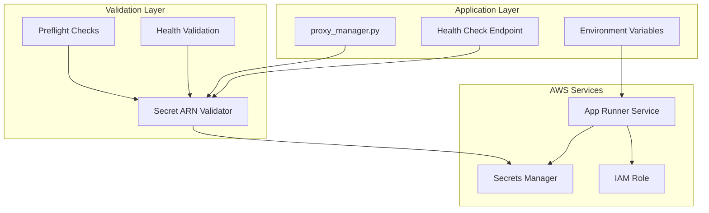

# Design Document

## Overview

This design addresses the proxy configuration secret validation error by identifying and fixing the root cause of the ValidationException, ensuring proper secret name formatting, and implementing comprehensive secret validation throughout the application and deployment process.

The current error indicates that the secret name being used doesn't meet AWS Secrets Manager naming requirements, which only allow alphanumeric characters and specific special characters (-/_+=.@!).

## Architecture

### Current State Analysis

The health check shows:
```json
{
  "proxy_config": {
    "error": "An error occurred (ValidationException) when calling the GetSecretValue operation: Invalid name. Must be a valid name containing alphanumeric characters, or any of the following: -/_+=.@!"
  }
}
```

This suggests the application is attempting to use an invalid secret name or ARN format.

### Root Cause Investigation

The issue likely stems from one of these causes:

1. **Malformed Secret ARN**: The environment variable contains an incorrectly formatted ARN
2. **Environment Variable Corruption**: The ARN is being modified or truncated during runtime
3. **Code Logic Error**: The application is constructing or modifying the secret name incorrectly
4. **App Runner Configuration Issue**: The secret reference in App Runner configuration is malformed

### Target Architecture



## Components and Interfaces

### 1. Secret ARN Validation Module

**Purpose:** Validate secret ARN format and accessibility

**Interface:**
```python
class SecretValidator:
    def validate_arn_format(self, arn: str) -> bool:
        """Validate ARN format against AWS requirements"""
        
    def validate_secret_accessibility(self, arn: str) -> dict:
        """Test actual secret retrieval"""
        
    def get_secret_validation_report(self) -> dict:
        """Generate comprehensive validation report"""
```

### 2. Enhanced Proxy Manager

**Purpose:** Robust proxy configuration with validation

**Interface:**
```python
class ProxyManager:
    def __init__(self):
        self.secret_validator = SecretValidator()
        
    def load_proxy_config(self) -> dict:
        """Load and validate proxy configuration"""
        
    def validate_proxy_credentials(self, config: dict) -> bool:
        """Validate proxy credentials format"""
        
    def test_proxy_connectivity(self) -> bool:
        """Test actual proxy authentication"""
```

### 3. Deployment Secret Validation

**Purpose:** Validate secrets during deployment

**Interface:**
```bash
validate_secret_configuration() {
    # Validate all secret ARNs in App Runner configuration
    # Check secret accessibility with instance role
    # Verify secret content format
}
```

## Data Models

### Secret Validation Result
```python
@dataclass
class SecretValidationResult:
    arn: str
    is_valid_format: bool
    is_accessible: bool
    error_message: Optional[str]
    content_valid: bool
    validation_timestamp: datetime
```

### Proxy Configuration
```python
@dataclass
class ProxyConfig:
    host: str
    port: int
    username: str
    password: str
    protocol: str = "http"
    
    def validate(self) -> bool:
        """Validate all required fields are present"""
```

## Error Handling

### Secret Name Validation Errors

**Error Types:**
1. **Invalid ARN Format**: ARN doesn't match AWS ARN pattern
2. **Invalid Characters**: Secret name contains disallowed characters
3. **Access Denied**: IAM permissions insufficient
4. **Secret Not Found**: Secret doesn't exist in specified region
5. **Malformed Content**: Secret content isn't valid JSON

**Error Response Format:**
```python
{
    "error_type": "INVALID_SECRET_NAME",
    "error_message": "Secret name contains invalid characters",
    "suggested_fix": "Ensure secret name only contains alphanumeric and -/_+=.@!",
    "current_value": "problematic-secret-name",
    "valid_example": "valid-secret-name"
}
```

### Recovery Strategies

1. **ARN Format Correction**: Automatically detect and suggest correct ARN format
2. **Environment Variable Validation**: Check all secret-related env vars during startup
3. **Fallback Configuration**: Use default proxy settings if secret is inaccessible
4. **Graceful Degradation**: Continue operation without proxy if validation fails

## Implementation Strategy

### Phase 1: Root Cause Identification

1. **Investigate Current Secret Configuration**
   - Check App Runner environment variables
   - Validate secret ARN format
   - Test secret accessibility with current IAM role

2. **Identify the Problematic Secret Reference**
   - Examine OXYLABS_PROXY_CONFIG environment variable
   - Check if ARN is being modified in code
   - Verify secret exists in AWS Secrets Manager

### Phase 2: Fix Secret Configuration

1. **Correct Secret ARN Format**
   - Update App Runner service configuration if needed
   - Ensure proper ARN format in deployment scripts
   - Validate secret name meets AWS requirements

2. **Update Application Code**
   - Add secret ARN validation in proxy_manager.py
   - Improve error handling for secret retrieval
   - Add comprehensive logging for debugging

### Phase 3: Enhance Validation

1. **Add Preflight Secret Validation**
   - Validate all secret ARNs during deployment
   - Check secret accessibility before service update
   - Provide clear error messages for secret issues

2. **Improve Health Check Validation**
   - Test actual secret retrieval, not just configuration
   - Validate secret content format
   - Test proxy connectivity if possible

### Phase 4: Testing and Verification

1. **Comprehensive Testing**
   - Test with corrected secret configuration
   - Verify proxy authentication works
   - Confirm 407 errors are resolved

2. **Deployment Validation**
   - Test deployment script secret validation
   - Verify health checks pass with corrected configuration
   - Confirm end-to-end proxy functionality

## Security Considerations

### Secret Handling
- Never log secret values, only ARNs and validation status
- Use secure methods for secret retrieval
- Implement proper error handling to avoid secret leakage

### IAM Permissions
- Ensure instance role has minimal required permissions
- Validate secretsmanager:GetSecretValue permission for specific ARNs
- Use resource-specific permissions, not wildcard access

### Proxy Security
- Validate proxy credentials format without exposing values
- Use secure proxy protocols where possible
- Implement connection timeouts and retry logic

## Testing Strategy

### Unit Testing
- Test secret ARN format validation
- Test proxy configuration parsing
- Test error handling for various failure scenarios

### Integration Testing
- Test secret retrieval with actual AWS Secrets Manager
- Test proxy authentication with real proxy service
- Test health check validation end-to-end

### Deployment Testing
- Test deployment script secret validation
- Test App Runner service updates with corrected configuration
- Verify health checks pass after deployment

## Monitoring and Observability

### Metrics
- Secret validation success/failure rates
- Proxy authentication success rates
- Health check proxy validation results

### Logging
- Log secret validation attempts (ARN only, not content)
- Log proxy authentication attempts
- Log health check validation results

### Alerting
- Alert on secret validation failures
- Alert on proxy authentication failures
- Alert on health check degradation

## Migration Strategy

### Immediate Fix
1. Identify and correct the malformed secret ARN
2. Update App Runner service configuration
3. Verify proxy functionality works

### Long-term Improvements
1. Add comprehensive secret validation to deployment process
2. Enhance application error handling and logging
3. Implement monitoring and alerting for secret issues

This design ensures robust proxy configuration management while providing comprehensive validation and error handling throughout the application lifecycle.