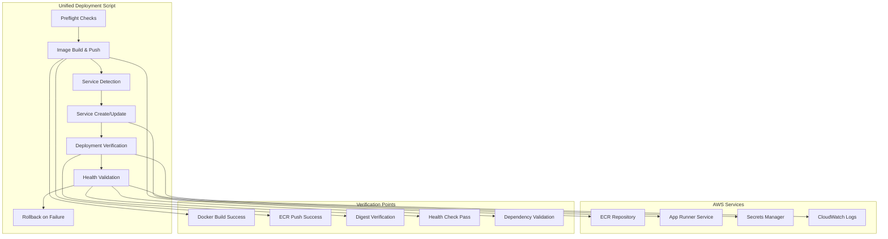

# Design Document

## Overview

This design creates a unified, bulletproof deployment script that consolidates the current three deployment scripts into a single reliable solution. The script addresses the core issues of App Runner not recognizing image updates, services not restarting properly, and deployment process confusion by implementing digest verification, comprehensive health checks, automatic rollback, and intelligent AutoDeployments management.

The solution eliminates the need to choose between multiple scripts by automatically detecting service state and handling both creation and update scenarios seamlessly.

## Architecture

### Current State Analysis

The application currently has three deployment scripts with overlapping functionality:
- `deploy.sh`: Basic ECR build/push only (no App Runner updates)
- `deployment/deploy-apprunner.sh`: Full service creation (doesn't update existing)
- `deployment/deploy-with-apprunner-update.sh`: Service updates (complex, unreliable)

### Target Architecture



## Components and Interfaces

### 1. Unified Deployment Script (`deploy.sh`)

**Core Interface:**
```bash
./deploy.sh [OPTIONS]

Options:
  --service-name NAME     App Runner service name (default: tldw-container-app)
  --region REGION         AWS region (default: us-west-2)  
  --ecr-repo REPO         ECR repository name (default: tldw)
  --force-latest          Force deployment even with :latest tag
  --force-restart         Always call start-deployment after update
  --dry-run              Show planned actions without executing
  --tail                 Stream logs during deployment
  --json                 Output machine-readable JSON
  --cleanup-old          Remove old deployment scripts
  --prune-images N       Keep only N most recent ECR images (default: 10)
  --help                 Show usage information

Environment Variables:
  SERVICE_NAME           Override service name
  AWS_REGION            Override AWS region
  ECR_REPOSITORY        Override ECR repository
  ALLOW_MISSING_DEPS    Allow deployment with missing dependencies
```

### 2. Preflight Validation System

**Purpose:** Catch configuration issues before expensive build/push operations

**Components:**
- Docker daemon connectivity check
- AWS CLI configuration validation
- ECR repository access verification
- Service configuration alignment check (port 8080, health path /healthz)
- IAM permissions validation
- Secrets accessibility verification (instance role has secretsmanager:GetSecretValue for OXYLABS_PROXY_CONFIG ARN)

**Interface:**
```bash
preflight_checks() {
    check_docker_daemon
    check_aws_credentials
    check_ecr_access
    check_service_alignment
    check_iam_permissions
}
```

### 3. Image Management System

**Tagging Strategy:**
- Primary tag: Git commit hash (e.g., `abc1234`)
- Fallback tag: Timestamp (e.g., `20250816-143022`)
- Always maintain `:latest` for AutoDeployments

**Digest Verification:**
```bash
verify_image_digest() {
    local target_tag="$1"
    local ecr_digest=$(aws ecr describe-images --repository-name "$ECR_REPO" --image-ids imageTag="$target_tag" --query 'imageDetails[0].imageDigest' --output text)
    local service_digest=$(aws apprunner describe-service --service-arn "$SERVICE_ARN" --query 'Service.DeployedImageDigest' --output text)
    
    if [[ "$ecr_digest" == "$service_digest" ]]; then
        return 0
    else
        return 1
    fi
}
```

### 4. Service State Management

**Service Detection Logic:**
```bash
detect_service_state() {
    local service_arn=$(aws apprunner list-services --query "ServiceSummaryList[?ServiceName=='$SERVICE_NAME'].ServiceArn" --output text)
    
    if [[ -z "$service_arn" ]]; then
        echo "CREATE_NEEDED"
    else
        local status=$(aws apprunner describe-service --service-arn "$service_arn" --query 'Service.Status' --output text)
        echo "UPDATE_NEEDED:$service_arn:$status"
    fi
}
```

**AutoDeployments Management:**
```bash
manage_auto_deployments() {
    local action="$1"  # save, disable, restore
    local service_arn="$2"
    
    case "$action" in
        "save")
            ORIGINAL_AUTO_DEPLOY=$(aws apprunner describe-service --service-arn "$service_arn" --query 'Service.SourceConfiguration.AutoDeploymentsEnabled' --output text)
            ;;
        "disable")
            # For immutable tags (git SHA): temporarily disable AutoDeployments during update
            aws apprunner update-service --service-arn "$service_arn" --source-configuration AutoDeploymentsEnabled=false
            ;;
        "restore")
            # Restore original setting after successful deployment
            aws apprunner update-service --service-arn "$service_arn" --source-configuration AutoDeploymentsEnabled="$ORIGINAL_AUTO_DEPLOY"
            ;;
    esac
}

update_service_with_normalized_config() {
    local service_arn="$1"
    local image_uri="$2"
    
    # Normalize runtime env/secrets to arrays of {Name,Value} when invoking update-service
    # App Runner update calls are strict about payload format (unlike create calls)
    local env_vars_array=$(get_current_env_vars_as_array "$service_arn")
    local secrets_array=$(get_current_secrets_as_array "$service_arn")
    
    aws apprunner update-service \
        --service-arn "$service_arn" \
        --source-configuration "{
            \"ImageRepository\": {
                \"ImageIdentifier\": \"$image_uri\",
                \"ImageRepositoryType\": \"ECR\",
                \"ImageConfiguration\": {
                    \"Port\": \"8080\",
                    \"RuntimeEnvironmentVariables\": $env_vars_array,
                    \"RuntimeEnvironmentSecrets\": $secrets_array
                }
            },
            \"AutoDeploymentsEnabled\": false
        }"
}
```

### 5. Health Validation System

**Multi-Layer Health Checks:**
1. App Runner service status verification
2. HTTP health endpoint testing (port/path mismatch guard)
3. Dependency availability validation
4. Secrets accessibility verification

**Deployment Wait Logic:**
```bash
wait_for_deployment_complete() {
    local service_arn="$1"
    local target_image_uri="$2"
    local target_digest="$3"
    
    # wait_for_deployment_complete SHALL require both Status=RUNNING and digest match before health validation
    while true; do
        local service_info=$(aws apprunner describe-service --service-arn "$service_arn")
        local status=$(echo "$service_info" | jq -r '.Service.Status')
        local deployed_digest=$(echo "$service_info" | jq -r '.Service.DeployedImageDigest // ""')
        
        case "$status" in
            "RUNNING")
                if [[ "$deployed_digest" == "$target_digest" ]]; then
                    echo "✅ Deployment complete: Status=RUNNING, digest matches"
                    return 0
                else
                    echo "⏳ Status=RUNNING but digest mismatch. Expected: $target_digest, Got: $deployed_digest"
                fi
                ;;
            "OPERATION_IN_PROGRESS")
                echo "⏳ Deployment in progress..."
                ;;
            "CREATE_FAILED"|"UPDATE_FAILED"|"DELETE_FAILED")
                echo "❌ Deployment failed with status: $status"
                return 1
                ;;
        esac
        
        sleep 15
    done
}
```

**Health Check Interface:**
```bash
validate_deployment_health() {
    local service_url="$1"
    local max_attempts=5
    local attempt=1
    
    while [[ $attempt -le $max_attempts ]]; do
        # Port/path mismatch guard: confirm app listens on 8080 and /healthz responds
        local health_response=$(curl -s -w "%{http_code}" "$service_url/healthz" --connect-timeout 10)
        local http_code="${health_response: -3}"
        local body="${health_response%???}"
        
        case "$http_code" in
            "200")
                validate_health_dependencies "$body"
                return $?
                ;;
            "404")
                echo "❌ Health endpoint not found - check health path configuration (/healthz)"
                return 1
                ;;
            "000")
                echo "⚠️  Connection refused - app may not be listening on port 8080 (attempt $attempt/$max_attempts)"
                ;;
            *)
                echo "⚠️  Health check returned $http_code (attempt $attempt/$max_attempts)"
                ;;
        esac
        
        sleep 10
        ((attempt++))
    done
    
    echo "❌ Health check failed after $max_attempts attempts"
    return 1
}

validate_health_dependencies() {
    local health_json="$1"
    
    # Decode JSON + dependency asserts
    local ffmpeg_available=$(echo "$health_json" | jq -r '.dependencies.ffmpeg.available // false')
    local ytdlp_available=$(echo "$health_json" | jq -r '.dependencies.yt_dlp.available // false')
    local proxy_readable=$(echo "$health_json" | jq -r '.secrets.proxy_config_readable // false')
    
    if [[ "$ffmpeg_available" != "true" || "$ytdlp_available" != "true" ]]; then
        echo "❌ Critical dependencies missing: ffmpeg=$ffmpeg_available, yt-dlp=$ytdlp_available"
        # Show last 20 lines of app logs on failure
        stream_recent_logs_on_failure
        return 1
    fi
    
    if [[ "$proxy_readable" != "true" ]]; then
        echo "❌ Proxy configuration not readable - will cause 407 errors"
        echo "   Check instance role has secretsmanager:GetSecretValue for OXYLABS_PROXY_CONFIG ARN"
        return 1
    fi
    
    return 0
}

force_deployment_restart() {
    local service_arn="$1"
    
    # If --force-restart is set (or deploying :latest), call aws apprunner start-deployment after update
    echo "🔄 Forcing deployment restart..."
    aws apprunner start-deployment --service-arn "$service_arn"
}
```

### 6. Rollback System

**Automatic Rollback Logic:**
```bash
rollback_deployment() {
    local service_arn="$1"
    local previous_tag="$2"
    local previous_digest="$3"
    
    echo "🔄 Rolling back to previous image: $previous_tag (digest: $previous_digest)"
    
    local previous_image_uri="${ECR_URI}:${previous_tag}"
    
    # Update service to previous image with normalized config
    update_service_with_normalized_config "$service_arn" "$previous_image_uri"
    
    # Wait for rollback to complete with digest verification
    wait_for_deployment_complete "$service_arn" "$previous_image_uri" "$previous_digest"
    
    # Validate rollback health (digest+health re-check)
    local service_url=$(aws apprunner describe-service --service-arn "$service_arn" --query 'Service.ServiceUrl' --output text)
    if validate_deployment_health "https://$service_url"; then
        echo "✅ Rollback successful and healthy"
        return 0
    else
        echo "❌ Rollback completed but health check failed"
        return 1
    fi
}
```

### 7. Logging and Observability

**Structured Logging:**
```bash
log_deployment_event() {
    local level="$1"
    local message="$2"
    local timestamp=$(date -u +"%Y-%m-%dT%H:%M:%SZ")
    
    if [[ "$JSON_OUTPUT" == "true" ]]; then
        echo "{\"timestamp\":\"$timestamp\",\"level\":\"$level\",\"message\":\"$message\"}"
    else
        echo "[$timestamp] $level: $message"
    fi
}
```

**App Runner Log Streaming:**
```bash
stream_apprunner_logs() {
    local service_arn="$1"
    local duration_seconds="$2"
    
    # Get recent logs for troubleshooting
    aws logs tail "/aws/apprunner/$SERVICE_NAME" \
        --since "${duration_seconds}s" \
        --follow \
        --format short
}

stream_recent_logs_on_failure() {
    # Show last 20 lines of app logs on failure (automatic when health fails)
    echo "📋 Recent application logs:"
    aws logs tail "/aws/apprunner/$SERVICE_NAME" \
        --since "300s" \
        --format short | tail -20
}

show_deployment_summary() {
    local service_url="$1"
    local image_tag="$2"
    local deployed_digest="$3"
    local elapsed_seconds="$4"
    
    # Show exactly what shipped: service URL, image tag and deployed digest, elapsed time
    echo ""
    echo "🎉 Deployment Summary:"
    echo "   Service URL: https://$service_url"
    echo "   Image Tag: $image_tag"
    echo "   Deployed Digest: $deployed_digest"
    echo "   Elapsed Time: ${elapsed_seconds}s"
    echo ""
    echo "🧪 Test Endpoints:"
    echo "   Health: https://$service_url/healthz"
    echo "   Application: https://$service_url/"
}
```

## Data Models

### Deployment State Model
```bash
# Global deployment state tracking
declare -A DEPLOYMENT_STATE=(
    ["service_arn"]=""
    ["previous_image_tag"]=""
    ["previous_image_digest"]=""  # Capture prior digest for rollback
    ["target_image_tag"]=""
    ["target_image_digest"]=""
    ["original_auto_deploy"]=""
    ["deployment_start_time"]=""
    ["rollback_attempted"]="false"
)
```

### Health Status Model
```json
{
  "status": "healthy|degraded|unhealthy",
  "timestamp": "2025-08-16T14:30:22Z",
  "dependencies": {
    "ffmpeg": {
      "available": true,
      "path": "/usr/bin/ffmpeg",
      "version": "4.4.2"
    },
    "yt_dlp": {
      "available": true,
      "version": "2024.08.06"
    }
  },
  "secrets": {
    "proxy_config_readable": true,
    "openai_key_readable": true
  },
  "deployment": {
    "image_tag": "abc1234",
    "deployed_at": "2025-08-16T14:25:00Z"
  }
}
```

### Deployment Result Model
```json
{
  "success": true,
  "service_arn": "arn:aws:apprunner:us-west-2:123456789012:service/tldw-container-app/abc123",
  "service_url": "https://abc123.us-west-2.awsapprunner.com",
  "deployed_image": {
    "tag": "abc1234",
    "digest": "sha256:abc123...",
    "uri": "123456789012.dkr.ecr.us-west-2.amazonaws.com/tldw:abc1234"
  },
  "deployment_time_seconds": 245,
  "health_check": {
    "status": "healthy",
    "response_time_ms": 150
  },
  "rollback_performed": false
}
```

## Error Handling

### Exit Code Strategy
```bash
# Standardized exit codes for CI/CD integration
EXIT_CODES=(
    [0]="Success"
    [1]="General error"
    [10]="Docker build failure"
    [11]="ECR push failure"
    [12]="App Runner update failure"
    [13]="Health check failure"
    [14]="Deployment timeout"
    [15]="Rollback failure"
    [20]="Preflight check failure"
    [21]="AWS credentials invalid"
    [22]="Docker daemon not running"
)
```

### Error Recovery Strategies

**Build Failures:**
- Check Docker daemon status
- Verify Dockerfile syntax
- Suggest common fixes (disk space, network connectivity)
- Provide build context information

**Push Failures:**
- Verify ECR repository exists
- Check ECR permissions
- Retry with exponential backoff
- Suggest manual ECR login

**Update Failures:**
- Parse AWS error messages
- Suggest IAM permission fixes
- Provide service configuration validation
- Offer manual console steps

**Health Check Failures:**
- Stream recent App Runner logs
- Parse health endpoint response
- Identify missing dependencies
- Suggest configuration fixes
- Trigger automatic rollback

## Security Considerations

### Secrets Management
- Never log secret values
- Validate IAM permissions before deployment
- Use AWS Secrets Manager ARNs consistently
- Verify secret accessibility without exposing content

### Container Security
- Use specific image tags (not :latest in production)
- Implement digest verification
- Maintain image provenance
- Regular security scanning integration points

### Access Control
- Principle of least privilege for IAM roles
- Service-specific ECR repository access
- App Runner service isolation
- Audit logging for deployment actions

## Performance Considerations

### Build Optimization
- Docker layer caching
- Multi-stage builds where beneficial
- Parallel dependency installation
- Build context minimization

### Deployment Speed
- Concurrent health checks
- Optimized polling intervals
- Early failure detection
- Efficient rollback procedures

### Resource Management
- ECR image lifecycle management
- App Runner instance sizing validation
- Memory and CPU utilization monitoring
- Cost optimization recommendations

## Testing Strategy

### Unit Testing
- Individual function validation
- Mock AWS API responses
- Error condition simulation
- Edge case handling

### Integration Testing
- End-to-end deployment scenarios
- Service creation and update flows
- Rollback mechanism validation
- Health check integration

### Acceptance Testing
- Real AWS environment deployment
- Multi-region deployment validation
- Performance benchmarking
- Security compliance verification

## Migration Strategy

### Phase 1: Script Development
- Implement unified deployment script
- Add comprehensive testing
- Validate against existing services

### Phase 2: Parallel Deployment
- Run new script alongside existing scripts
- Compare deployment outcomes
- Gather performance metrics

### Phase 3: Migration
- Update documentation
- Archive old scripts
- Train team on new process

### Phase 4: Optimization
- Performance tuning based on usage
- Additional feature development
- Monitoring and alerting integration

## Monitoring and Observability

### Deployment Metrics
- Deployment success rate
- Average deployment time
- Rollback frequency
- Health check response times

### Alerting
- Deployment failures
- Health check degradation
- Rollback events
- Performance anomalies

### Logging
- Structured deployment logs
- AWS CloudTrail integration
- App Runner service logs
- Performance metrics collection