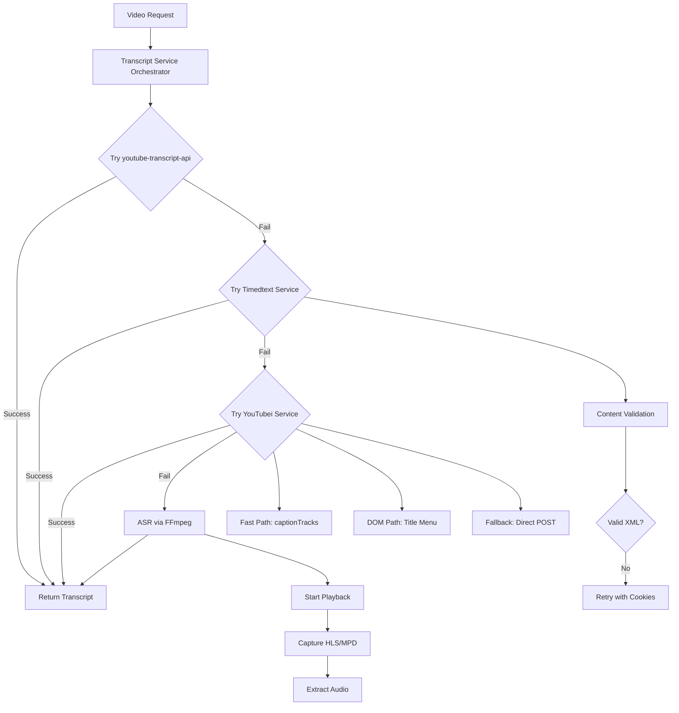

# Design Document

## Overview

This design implements a comprehensive reliability fix pack for the YouTube transcript extraction pipeline, addressing critical silent failures, timeout issues, and inefficient processing patterns. The solution targets three core services with specific architectural improvements:

1. **YouTubei Service**: Eliminates silent failures through proper Playwright API usage, implements fast-path caption extraction, and provides robust fallback mechanisms
2. **FFmpeg Service**: Enforces proxy compliance and prevents timeout overruns through reduced processing windows
3. **Transcript Service**: Adds content validation, fast-fail mechanisms, and improved ASR triggering

The design maintains backward compatibility while significantly improving success rates and processing efficiency.

## Architecture

### High-Level Flow



### Service Interaction Model

The three services interact through a hierarchical fallback system with enhanced error handling and logging:

- **Transcript Service** acts as the orchestrator, managing the extraction pipeline
- **YouTubei Service** provides three extraction paths with deterministic selectors
- **FFmpeg Service** handles audio extraction with strict proxy compliance
- **Timedtext Service** validates content before parsing (existing service, enhanced)

## Components and Interfaces

### YouTubei Service Enhancements

#### Fast-Path Caption Extraction

```python
class DeterministicYouTubeiCapture:
    async def _extract_captions_from_player_response(self, page: AsyncPage) -> Optional[str]:
        """Extract captions directly from ytInitialPlayerResponse without DOM interaction."""
        tracks = await page.evaluate("""
            () => {
                try {
                    const pr = window.ytInitialPlayerResponse || {};
                    const list = pr.captions?.playerCaptionsTracklistRenderer?.captionTracks || [];
                    return list.map(t => ({
                        baseUrl: t.baseUrl,
                        kind: t.kind || "",
                        lang: t.languageCode || "",
                        name: (t.name && t.name.simpleText) || ""
                    }));
                } catch (e) { return []; }
            }
        """)
        
        if tracks and len(tracks) > 0:
            # Prefer non-ASR English, else first available
            best_track = self._select_best_caption_track(tracks)
            if best_track and best_track.get('baseUrl'):
                return await self._fetch_transcript_xml_via_requests(best_track['baseUrl'])
        return None
```

#### Deterministic DOM Interaction

```python
class DeterministicYouTubeiCapture:
    # Deterministic selectors
    TITLE_ROW_MENU = "ytd-menu-renderer #button-shape button[aria-label*='More actions']"
    SHOW_TRANSCRIPT_ITEM = "tp-yt-paper-listbox [role='menuitem']:has-text('Show transcript')"
    
    async def _open_transcript_via_title_menu(self) -> bool:
        """Open transcript panel using deterministic title-row menu."""
        try:
            # Wait for menu button to be visible
            btn = self.page.locator(self.TITLE_ROW_MENU).first
            await btn.wait_for(state="visible", timeout=5000)
            await btn.click(timeout=5000)
            
            # Wait for dropdown to open
            await self.page.wait_for_selector("tp-yt-iron-dropdown[opened] tp-yt-paper-listbox", timeout=5000)
            
            # Click transcript item
            item = self.page.locator(self.SHOW_TRANSCRIPT_ITEM).first
            await item.wait_for(state="visible", timeout=5000)
            await item.click(timeout=5000)
            
            self.transcript_button_clicked = True
            return True
        except Exception as e:
            evt("youtubei_title_menu_open_failed", err=str(e)[:120])
            return False
```

#### Enhanced Direct POST Fallback

```python
class DeterministicYouTubeiCapture:
    async def _direct_fetch_fallback(self) -> Optional[str]:
        """Direct POST to youtubei API using real page context."""
        try:
            # Extract real API context from page
            api_key = await self.page.evaluate("() => (window.ytcfg && ytcfg.get && ytcfg.get('INNERTUBE_API_KEY')) || null")
            context = await self.page.evaluate("() => (window.ytcfg && ytcfg.get && ytcfg.get('INNERTUBE_CONTEXT')) || null")
            
            # Extract params from captured requests or DOM
            params = await self._extract_transcript_params()
            
            if not (api_key and context and params):
                evt("youtubei_direct_missing_ctx", has_key=bool(api_key), has_ctx=bool(context), has_params=bool(params))
                return None
                
            # Make authenticated request with proxy support
            return await self._make_direct_transcript_request(api_key, context, params)
        except Exception as e:
            evt("youtubei_direct_exception", err=str(e)[:160])
            return None
```

### FFmpeg Service Proxy Enforcement

#### Strict Proxy Compliance

```python
class FFmpegService:
    def _requests_streaming_fallback(self, url: str, output_path: str) -> bool:
        """Streaming fallback with proxy enforcement."""
        # Enforce proxy-only networking if required
        if self.enforce_proxy:
            proxies = self._get_job_proxy_dict()
            if not proxies:
                evt("requests_fallback_blocked", job_id=self.job_id, reason="enforce_proxy_no_proxy")
                return False
        
        # Proceed with streaming download
        return self._stream_audio_content(url, output_path, proxies)
```

#### Header Placement and Audio Validation

```python
# Configuration constants
FFMPEG_TIMEOUT = 60  # Reduced from 120 to prevent watchdog overruns

class FFmpegService:
    def _ffmpeg_extract_attempt(self, audio_url: str, output_path: str, headers_str: str) -> str:
        """FFmpeg extraction with proper header placement and validation."""
        cmd = [
            "ffmpeg", "-y", "-loglevel", "error",
            # Network resilience flags
            "-rw_timeout", "60000000",
            "-reconnect", "1", "-reconnect_streamed", "1",
            "-reconnect_on_network_error", "1", "-reconnect_at_eof", "1",
            "-max_reload", "10", "-analyzeduration", "10M", "-probesize", "50M",
            # Headers must be immediately before -i
            "-headers", headers_str,
            "-i", audio_url,
            "-vn", "-ac", "1", "-ar", "16000", "-acodec", "pcm_s16le",
            "-f", "wav", "-err_detect", "ignore_err", "-fflags", "+genpts",
            output_path
        ]
        
        result = subprocess.run(cmd, timeout=FFMPEG_TIMEOUT, capture_output=True, text=True)
        
        # Always validate audio even for larger files
        if os.path.exists(output_path):
            validation_result = self._validate_audio_with_ffprobe(output_path)
            if validation_result != "success":
                os.unlink(output_path)  # Delete invalid file
                return validation_result
                
        return "success" if result.returncode == 0 else "ffmpeg_failed"
    
    def _validate_audio_with_ffprobe(self, output_path: str) -> str:
        """Validate audio file has actual content and duration."""
        try:
            cmd = ["ffprobe", "-v", "quiet", "-show_entries", "format=duration", 
                   "-of", "csv=p=0", output_path]
            result = subprocess.run(cmd, capture_output=True, text=True, timeout=10)
            
            if result.returncode != 0:
                return "invalid_audio_format"
                
            duration = float(result.stdout.strip() or "0")
            if duration <= 0:
                return "zero_duration_audio"
                
            return "success"
        except Exception:
            return "ffprobe_validation_failed"
```

### Transcript Service Content Validation

#### XML Content Validation and Blocking Detection

```python
class TranscriptService:
    def _validate_and_parse_xml(self, response) -> ET.Element:
        """Validate response content before XML parsing with early blocking detection."""
        xml_text = response.text.strip() if response and response.text else ""
        
        # Early blocking detection
        if "DOCTYPE html" in xml_text or "consent" in xml_text.lower():
            evt("timedtext_blocked", detail=xml_text[:200])
            raise ValueError("HTML/consent response received")
        
        # XML validation
        if not xml_text.startswith("<"):
            evt("timedtext_not_xml", content_preview=xml_text[:120])
            raise ValueError(f"Non-XML response received: {xml_text[:120]}")
            
        return ET.fromstring(xml_text)
    
    def _execute_transcript_pipeline(self, video_id: str, job_id: str, cookie_header: Optional[str] = None):
        """Execute pipeline ensuring cookie propagation to all stages."""
        # Ensure cookies are propagated to all downstream calls
        effective_cookies = cookie_header
        
        # Stage 1: Timedtext with cookies
        result = timedtext_with_job_proxy(video_id, job_id, proxy_manager, effective_cookies)
        if result:
            return result
            
        # Stage 2: YouTubei with cookies  
        result = self._enhanced_youtubei_stage(video_id, job_id, proxy_manager, effective_cookies)
        if result:
            return result
            
        # Stage 3: ASR with cookies
        return self._enhanced_asr_stage(video_id, job_id, proxy_manager, effective_cookies)
```

#### Fast-Fail YouTubei to ASR

```python
class TranscriptService:
    def _run_youtubei_with_timeout(self, video_id: str, job_id: str) -> Optional[str]:
        """Run YouTubei with fast-fail to ASR on timeout."""
        try:
            result = extract_transcript_with_job_proxy(
                video_id, 
                job_id, 
                hard_timeout=YOUTUBEI_HARD_TIMEOUT
            )
            return result
        except Exception as e:
            error_msg = str(e).lower()
            if "navigation timeout" in error_msg or "timeout" in error_msg:
                evt("youtubei_nav_timeout_short_circuit")
                return None  # Skip to ASR immediately
            raise
```

#### ASR Playback Triggering

```python
class TranscriptService:
    async def _trigger_asr_playback(self, page: AsyncPage) -> None:
        """Start video playback to trigger HLS/MPD manifest requests."""
        try:
            evt("asr_playback_initiated")
            
            # Use keyboard shortcut to start playback
            await page.keyboard.press("k")  # YouTube play/pause toggle
            
            # Also try clicking video element
            await page.locator("video").first.click(timeout=2000)
            
        except Exception as e:
            evt("asr_playback_trigger_failed", err=str(e)[:100])
            # Continue anyway - some videos may already be playing
```

## Data Models

### Enhanced Logging Events

```python
# New logging events for reliability tracking
RELIABILITY_EVENTS = {
    "youtubei_captiontracks_shortcircuit": {"lang": str, "asr": bool},
    "youtubei_captiontracks_probe_failed": {"err": str},
    "youtubei_title_menu_open_failed": {"err": str},
    "youtubei_direct_missing_ctx": {"has_key": bool, "has_ctx": bool, "has_params": bool},
    "requests_fallback_blocked": {"job_id": str, "reason": str},
    "timedtext_empty_body": {},
    "timedtext_html_or_block": {},
    "timedtext_not_xml": {},
    "youtubei_nav_timeout_short_circuit": {},
    "asr_playback_initiated": {},
    "ffmpeg_timeout_exceeded": {"timeout": int}
}
```

### Configuration Model

```python
@dataclass
class ReliabilityConfig:
    """Configuration for reliability fixes."""
    ffmpeg_timeout: int = 60
    youtubei_hard_timeout: int = 45
    enforce_proxy_all: bool = False
    enable_caption_tracks_shortcut: bool = True
    enable_deterministic_selectors: bool = True
    enable_content_validation: bool = True
    
    @classmethod
    def from_env(cls) -> 'ReliabilityConfig':
        """Load configuration from environment variables."""
        return cls(
            ffmpeg_timeout=int(os.getenv("FFMPEG_TIMEOUT", "60")),
            youtubei_hard_timeout=int(os.getenv("YOUTUBEI_HARD_TIMEOUT", "45")),
            enforce_proxy_all=os.getenv("ENFORCE_PROXY_ALL", "0").lower() in ("1", "true", "yes"),
            enable_caption_tracks_shortcut=os.getenv("ENABLE_CAPTION_TRACKS_SHORTCUT", "1").lower() in ("1", "true", "yes"),
            enable_deterministic_selectors=os.getenv("ENABLE_DETERMINISTIC_SELECTORS", "1").lower() in ("1", "true", "yes"),
            enable_content_validation=os.getenv("ENABLE_CONTENT_VALIDATION", "1").lower() in ("1", "true", "yes")
        )
```

## Error Handling

### Hierarchical Error Recovery

The system implements a three-tier error recovery strategy:

1. **Service-Level Recovery**: Each service attempts internal fallbacks before failing
2. **Pipeline-Level Recovery**: The transcript service moves to the next extraction method
3. **System-Level Recovery**: Graceful degradation with detailed error logging

### Error Classification

```python
class TranscriptReliabilityError(Exception):
    """Base class for reliability-related errors."""
    pass

class PlaywrightWaitError(TranscriptReliabilityError):
    """Error in Playwright wait operations."""
    pass

class ContentValidationError(TranscriptReliabilityError):
    """Error in content validation."""
    pass

class ProxyEnforcementError(TranscriptReliabilityError):
    """Error when proxy enforcement blocks operation."""
    pass

class TimeoutExceededError(TranscriptReliabilityError):
    """Error when operation exceeds configured timeout."""
    pass
```

### Retry Logic

```python
class ReliabilityRetryConfig:
    """Retry configuration for reliability fixes."""
    
    # No retries for same-path failures (prevent loops)
    YOUTUBEI_RETRIES = 0  # Fast-fail to next method
    TIMEDTEXT_RETRIES = 1  # One retry with cookies
    FFMPEG_RETRIES = 0    # No retries on timeout
    
    # Backoff strategies
    TIMEDTEXT_BACKOFF = 2  # seconds between retries
```

## Testing Strategy

### Unit Testing

1. **Playwright API Fixes**: Mock Playwright operations to verify proper `wait_for` usage
2. **Content Validation**: Test XML/HTML detection with various response types
3. **Proxy Enforcement**: Verify blocking behavior when `ENFORCE_PROXY_ALL=1`
4. **Timeout Handling**: Test timeout enforcement and fast-fail mechanisms

### Integration Testing

1. **End-to-End Pipeline**: Test complete transcript extraction with reliability fixes
2. **Fallback Chains**: Verify proper fallback behavior between services
3. **Logging Verification**: Confirm expected events are logged at each stage
4. **Performance Testing**: Measure improvement in success rates and processing time

### Regression Testing

1. **Backward Compatibility**: Ensure existing functionality remains intact
2. **Configuration Testing**: Test various environment variable combinations
3. **Error Scenarios**: Verify graceful handling of network issues, consent walls, etc.

### Test Data Requirements

```python
TEST_SCENARIOS = {
    "caption_tracks_available": "video_with_embedded_captions",
    "dom_interaction_required": "video_requiring_transcript_panel",
    "consent_wall_present": "video_with_consent_requirements",
    "timeout_scenarios": "slow_loading_video_pages",
    "proxy_enforcement": "videos_requiring_proxy_access",
    "content_validation": "videos_with_html_responses"
}
```

This design provides a comprehensive solution to the reliability issues while maintaining the existing architecture and ensuring backward compatibility. The implementation will be done incrementally through the task list to minimize risk and allow for thorough testing at each stage.