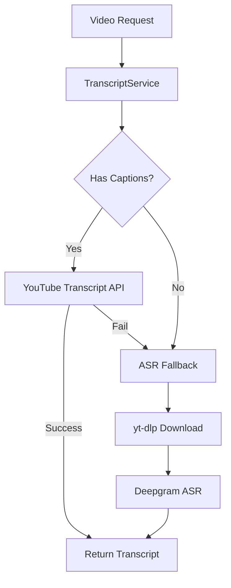
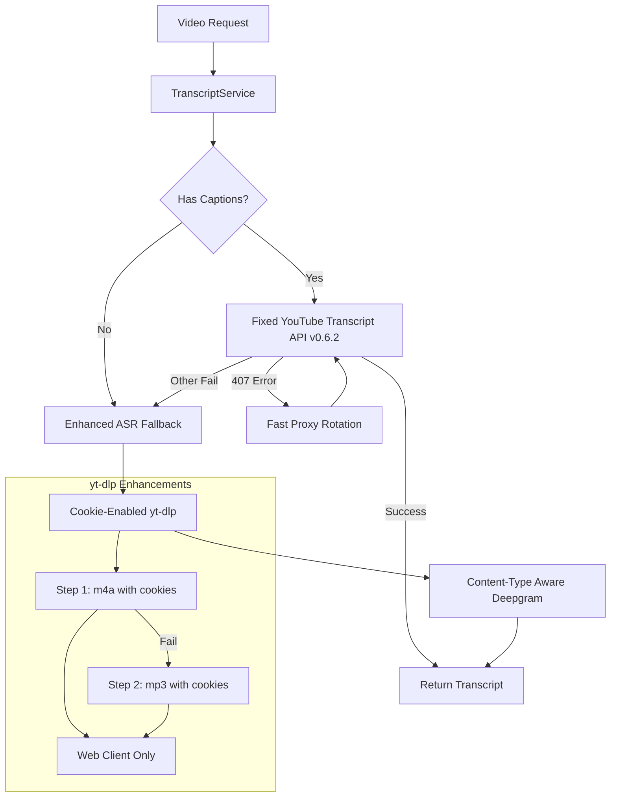

# Design Document

## Overview

This design addresses critical production bugs in the TL;DW backend's transcript fetching and audio download systems. The solution focuses on fixing immediate issues while maintaining backwards compatibility and adding observability improvements.

The core problems being solved are:
1. **YouTube Transcript API version incompatibility** causing AttributeError exceptions
2. **yt-dlp cookie passing failures** preventing authenticated downloads
3. **Unstable client selection** causing extraction failures
4. **Inefficient 407 proxy error handling** wasting resources on failed credentials
5. **Missing Content-Type headers** for Deepgram uploads

## Architecture

### Current System Flow


### Enhanced System Flow


## Components and Interfaces

### 1. Dependency Version Management

#### Fixed Version Pinning
The requirements.txt will be updated to pin critical dependencies:

```txt
youtube-transcript-api==0.6.2  # Fixed API compatibility
yt-dlp==2025.8.11             # Verified stable version
```

**Rationale:** Version 0.6.2 of youtube-transcript-api has the correct `get_transcript` method signature that the current code expects. Pinning yt-dlp prevents unexpected behavior changes in extraction logic.

### 2. Enhanced yt-dlp Configuration

#### Cookie Integration Fix
The `download_audio_with_fallback` function will be modified to properly pass cookies to both download steps:

```python
def download_audio_with_fallback(
    video_url: str,
    ua: str,
    proxy_url: str,
    ffmpeg_path: str = "/usr/bin",
    logger: Optional[Callable[[str], None]] = None,
    cookiefile: Optional[str] = None,  # Enhanced parameter
) -> str:
```

**Key Changes:**
- Add cookiefile validation before use
- Include cookiefile in both `ydl_opts_step1` and `ydl_opts_step2`
- Log cookie usage without exposing contents

#### Stable Client Selection
Both download steps will use consistent extractor arguments:

```python
base_opts = {
    # ... existing options ...
    "extractor_args": {"youtube": {"player_client": ["web"]}},  # Simplified to web only
}
```

**Rationale:** The web client works most reliably with cookies and provides consistent behavior. Removing multiple client options reduces variability and potential failures.

### 3. Proxy Error Handling Enhancement

#### 407 Error Fast-Fail Strategy
The transcript service will implement immediate proxy rotation on 407 errors:

```python
def _handle_407_error(self, video_id: str, session: ProxySession) -> bool:
    """Handle 407 errors with fast rotation"""
    logging.warning(f"407 Proxy Authentication Required for {video_id}, rotating proxy")
    session.mark_failed()
    
    # Optional no-proxy fallback (disabled by default)
    if os.getenv("ALLOW_NO_PROXY_ON_407", "false").lower() == "true":
        return self._attempt_no_proxy_fallback(video_id)
    
    return False
```

**Design Decisions:**
- Fail-fast approach prevents wasting time on bad credentials
- Optional no-proxy fallback controlled by environment variable
- Immediate session marking prevents reuse of failed proxies

### 4. Content-Type Header Management

#### Deepgram Upload Enhancement
The `_send_to_deepgram` method will use explicit MIME type mapping:

```python
def _send_to_deepgram(self, audio_file_path: str) -> Optional[str]:
    # Explicit mapping for common formats
    EXT_MIME_MAP = {
        ".m4a": "audio/mp4",
        ".mp4": "audio/mp4", 
        ".mp3": "audio/mpeg"
    }
    
    _, ext = os.path.splitext(audio_file_path.lower())
    content_type = EXT_MIME_MAP.get(ext, "application/octet-stream")
    
    headers = {
        'Authorization': f'Token {self.deepgram_api_key}',
        'Content-Type': content_type
    }
```

**Benefits:**
- Correct Content-Type headers improve Deepgram processing
- Explicit mapping is more reliable than mimetypes.guess_type()
- Fallback to octet-stream for unknown formats

## Data Models

### Error Message Structure
Enhanced error propagation will combine step failures:

```python
class DownloadResult:
    success: bool
    audio_path: Optional[str]
    error_message: Optional[str]  # Combined "step1_error || step2_error"
    cookies_used: bool
    client_used: str
```

### Health Diagnostic Model
New health endpoint will expose system state:

```python
class HealthDiagnostics:
    yt_dlp_version: str
    ffmpeg_location: str
    last_download_used_cookies: bool
    last_download_client: str
    proxy_pool_status: str
```

## Error Handling

### 1. YouTube Transcript API Errors
- **Version Compatibility**: Pin to 0.6.2 to ensure `get_transcript` method exists
- **Import Validation**: Add startup check to verify API can be imported
- **Graceful Degradation**: Fall back to ASR if API fails

### 2. yt-dlp Download Errors
- **Cookie Validation**: Check file exists and has content before passing to yt-dlp
- **Step Combination**: Preserve both step1 and step2 error messages
- **Bot Detection**: Enhanced pattern matching for various bot-check messages

### 3. Proxy Authentication Errors
- **407 Detection**: Fast identification of proxy auth failures
- **Rotation Logic**: Immediate proxy switching without retry delays
- **Fallback Strategy**: Optional no-proxy mode with environment control

### 4. Content-Type Errors
- **Format Detection**: Reliable file extension to MIME type mapping
- **Deepgram Compatibility**: Ensure headers match actual audio format
- **Fallback Handling**: Use octet-stream for unknown formats

## Testing Strategy

### Unit Testing
- **Version Compatibility**: Test YouTube Transcript API import and method calls
- **Cookie Passing**: Verify cookiefile parameter reaches yt-dlp configuration
- **Error Combination**: Test step1/step2 error message joining
- **Content-Type Mapping**: Validate MIME type selection for various file extensions

### Integration Testing
- **End-to-End Flow**: Test complete transcript → ASR → Deepgram pipeline
- **Proxy Rotation**: Test 407 error handling and session rotation
- **Cookie Authentication**: Test authenticated vs non-authenticated downloads
- **Client Consistency**: Verify web client is used in both download steps

### CI Smoke Testing
A new CI job will validate core functionality:

```yaml
name: TL;DW Smoke Test
steps:
  - name: Test Public Video Transcript
    run: |
      # Test known public video with captions
      curl -X POST /api/transcript -d '{"video_id": "dQw4w9WgXcQ"}'
  
  - name: Test Public Video ASR
    run: |
      # Test known public video without captions (force ASR path)
      curl -X POST /api/transcript -d '{"video_id": "test_video_id", "force_asr": true}'
```

### Performance Testing
- **Cookie Resolution**: Measure impact of cookie file operations
- **Proxy Rotation**: Test rotation speed and session management
- **Download Success Rates**: Compare step1 vs step2 success with new configuration

## Deployment Considerations

### Environment Variables
New configuration options:
```bash
# Proxy fallback control
ALLOW_NO_PROXY_ON_407=false  # Default disabled for security

# Health endpoint configuration  
EXPOSE_HEALTH_DIAGNOSTICS=true  # Enable diagnostic info
```

### Backwards Compatibility
- **API Interfaces**: No changes to public endpoints
- **Log Formats**: Maintain existing structured logging
- **Configuration**: All new features are opt-in or backwards compatible
- **Dependencies**: Version pins are conservative and tested

### Rollback Strategy
- **Quick Disable**: Revert requirements.txt to previous versions
- **Feature Flags**: Use environment variables to disable new behaviors
- **Monitoring**: Enhanced logging to detect issues early
- **Gradual Rollout**: Deploy to staging first with comprehensive testing

### Security Considerations
- **Cookie Handling**: Never log cookie file contents
- **Proxy Credentials**: Mask authentication details in logs
- **Health Endpoint**: Expose only non-sensitive diagnostic information
- **Error Messages**: Sanitize error output to prevent information leakage

## Monitoring and Observability

### Enhanced Logging
- **Cookie Usage**: Track when cookies are used vs not used
- **Client Selection**: Log which YouTube client was used for extraction
- **Error Categorization**: Classify failures by type (407, bot-check, timeout, etc.)
- **Performance Metrics**: Track step1 vs step2 success rates

### Health Endpoint Enhancement
The `/healthz` endpoint will include:
- yt-dlp version information
- FFmpeg location and availability
- Last download attempt metadata (without sensitive data)
- Proxy pool health status

### Alerting Integration
- **High 407 Error Rates**: Alert when proxy authentication failures spike
- **Bot Detection Increases**: Monitor for increased bot-check patterns
- **Download Success Degradation**: Alert when ASR fallback rates increase significantly
- **Version Compatibility**: Alert on startup if dependencies can't be imported

This design provides a comprehensive solution to the identified bugs while maintaining system stability and adding valuable observability improvements.