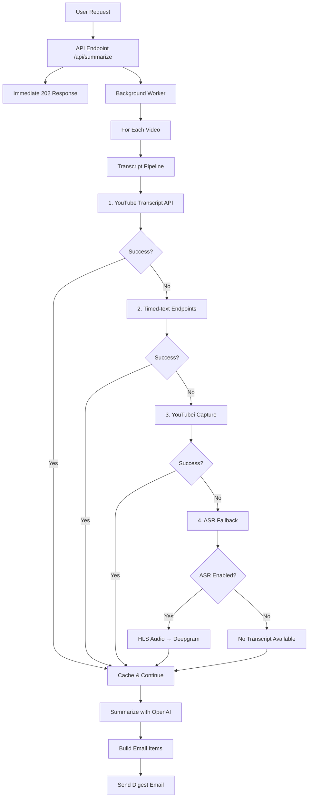
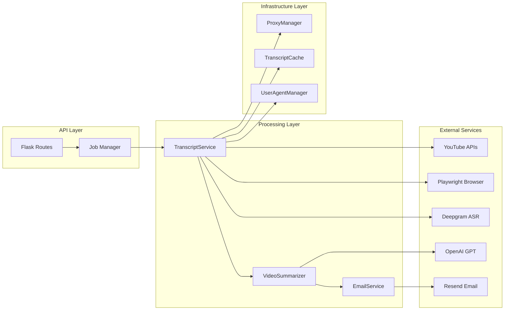

# Design Document

## Overview

The No-YT-DL Summarization Stack is a robust, multi-tier transcript acquisition and summarization system that eliminates dependency on yt-dlp while maintaining high reliability. The system implements a hierarchical fallback strategy for obtaining video transcripts, followed by AI-powered summarization and email delivery.

The architecture prioritizes performance, cost control, and reliability through:
- **Hierarchical transcript acquisition** with 4 fallback tiers
- **Asynchronous processing** with immediate user feedback
- **Comprehensive caching** with source attribution
- **Configurable ASR fallback** with cost controls
- **Robust error handling** with graceful degradation

## Architecture

### High-Level Flow



### Component Architecture



## Components and Interfaces

### 1. Enhanced TranscriptService

**Primary Interface:**
```python
class TranscriptService:
    def get_transcript(self, video_id: str, language: str = "en", user_cookies=None) -> str:
        """
        Hierarchical transcript acquisition with comprehensive fallback.
        Returns transcript text or empty string if all methods fail.
        """
```

**Key Methods:**
- `get_captions_via_api()` - YouTube Transcript API (fastest)
- `get_captions_via_timedtext()` - Direct HTTP endpoints with retry logic
- `get_transcript_via_youtubei()` - UI-agnostic Playwright capture
- `asr_from_hls_audio()` - Audio extraction + Deepgram transcription

**Enhancements Required:**
1. **Add YouTube Transcript API as first tier** (currently missing)
2. **Implement ASR fallback** with HLS audio interception
3. **Add comprehensive timeout controls** per NFR specifications
4. **Enhance logging** with source attribution and timing metrics
5. **Add cookie format conversion** for Playwright compatibility

### 2. Async Job Processing System

**New Component - JobManager:**
```python
class JobManager:
    def __init__(self, worker_concurrency: int = 2):
        self.executor = ThreadPoolExecutor(max_workers=worker_concurrency)
        self.jobs = {}  # {job_id: {status, error, created_at}}
    
    def submit_summarization_job(self, user_id: int, video_ids: list) -> str:
        """Submit job and return job_id immediately"""
    
    def get_job_status(self, job_id: str) -> dict:
        """Get current job status"""
```

**Job States:**
- `queued` - Job submitted, waiting for worker
- `processing` - Worker actively processing videos
- `done` - All videos processed, email sent
- `error` - Job failed with error details

### 3. Enhanced VideoSummarizer

**Interface Update:**
```python
class VideoSummarizer:
    def summarize_video(self, transcript_text: str, video_id: str) -> str:
        """
        Explicit parameter naming to prevent argument confusion.
        Returns summary text or "No transcript available." for empty input.
        """
```

**Key Changes:**
1. **Explicit parameter validation** - Check for empty/invalid transcript
2. **Graceful handling** - Return standard message for missing transcripts
3. **Enhanced error handling** - Never crash the pipeline

### 4. Email Service Enhancements

**Updated Interface:**
```python
class EmailService:
    def send_digest_email(self, user_email: str, items: list[dict]) -> bool:
        """
        Send consolidated digest with flat item structure.
        items: [{"title": str, "thumbnail_url": str, "video_url": str, "summary": str}]
        """
```

**Template Requirements:**
1. **Graceful field handling** - Default values for missing fields
2. **Single email per job** - Consolidate all videos into one digest
3. **Responsive design** - Mobile-friendly email template

### 5. ASR Implementation (New)

**Component - ASRAudioExtractor:**
```python
class ASRAudioExtractor:
    def extract_and_transcribe(self, video_id: str, proxy_manager=None, cookies=None) -> str:
        """
        Extract audio via HLS interception and transcribe with Deepgram.
        Includes cost controls and duration limits.
        """
```

**Process Flow:**
1. **HLS Interception** - Playwright captures .m3u8 audio streams
2. **Audio Extraction** - ffmpeg converts to WAV format
3. **Deepgram Transcription** - Send audio to ASR service
4. **Cleanup** - Remove temporary audio files
5. **Cost Controls** - Respect duration and quota limits

## Data Models

### Job Status Model
```python
@dataclass
class JobStatus:
    job_id: str
    status: Literal["queued", "processing", "done", "error"]
    created_at: datetime
    updated_at: datetime
    user_id: int
    video_count: int
    processed_count: int
    error_message: Optional[str] = None
```

### Transcript Cache Entry
```python
@dataclass
class TranscriptCacheEntry:
    video_id: str
    language: str
    transcript_text: str
    source: Literal["yt_api", "timedtext", "youtubei", "asr"]
    cached_at: datetime
    ttl_days: int
    user_id: Optional[int] = None  # For user-specific cookies
```

### Email Item Structure
```python
@dataclass
class EmailItem:
    title: str
    thumbnail_url: str
    video_url: str
    summary: str
    
    def to_dict(self) -> dict:
        return {
            "title": self.title or "(Untitled)",
            "thumbnail_url": self.thumbnail_url or "",
            "video_url": self.video_url or "#",
            "summary": self.summary or "No transcript available."
        }
```

## Error Handling

### Hierarchical Fallback Strategy

1. **YouTube Transcript API Failure**
   - Log attempt and reason
   - Proceed to timed-text endpoints
   - No user impact

2. **Timed-text Endpoint Failure**
   - Try multiple languages and caption types
   - Retry with different hosts
   - Fall back to proxy if configured
   - Proceed to YouTubei capture

3. **YouTubei Capture Failure**
   - Try desktop then mobile URLs
   - Try no-proxy then proxy
   - Handle consent dialogs and UI changes
   - Proceed to ASR if enabled

4. **ASR Failure**
   - Check duration limits
   - Verify Deepgram API key
   - Handle audio extraction errors
   - Return "No transcript available"

### Pipeline Resilience

```python
def get_transcript_with_fallback(video_id: str) -> tuple[str, str]:
    """
    Returns (transcript_text, source) where source indicates which method succeeded.
    Never raises exceptions - always returns a result.
    """
    methods = [
        ("yt_api", self.get_captions_via_api),
        ("timedtext", get_captions_via_timedtext),
        ("youtubei", get_transcript_via_youtubei),
        ("asr", self.asr_from_hls_audio if asr_enabled else None)
    ]
    
    for source, method in methods:
        if method is None:
            continue
        try:
            result = method(video_id, **kwargs)
            if result and result.strip():
                return result, source
        except Exception as e:
            log_method_failure(source, video_id, e)
            continue
    
    return "", "none"
```

### Job-Level Error Handling

- **Individual video failures** don't stop the job
- **Email failures** are logged but don't retry
- **Critical errors** (auth, config) fail the entire job
- **Partial success** still sends email with available summaries

## Testing Strategy

### Unit Tests

1. **TranscriptService Tests**
   - Mock each transcript acquisition method
   - Test fallback chain behavior
   - Verify caching with source attribution
   - Test timeout and error handling

2. **JobManager Tests**
   - Test job lifecycle (queued → processing → done)
   - Test concurrent job handling
   - Test error propagation and status updates

3. **ASR Component Tests**
   - Mock Playwright audio interception
   - Mock ffmpeg audio extraction
   - Mock Deepgram API responses
   - Test cost control limits

### Integration Tests

1. **End-to-End Pipeline Tests**
   - Test complete flow from API request to email
   - Test with various video types (public, restricted, shorts)
   - Test mixed success/failure scenarios

2. **Performance Tests**
   - Verify 202 response time < 500ms
   - Test per-video processing within budget (45s)
   - Test worker concurrency limits

3. **Reliability Tests**
   - Test proxy connectivity failures
   - Test external service outages
   - Test browser automation edge cases

### Test Matrix Implementation

```python
class TestScenarios:
    def test_public_video_with_captions(self):
        """Should succeed via yt_api or timedtext, send email"""
    
    def test_public_video_auto_captions_only(self):
        """Should succeed via timedtext with kind=asr"""
    
    def test_no_captions_asr_disabled(self):
        """Should return 'No transcript available', still send email"""
    
    def test_no_captions_asr_enabled(self):
        """Should succeed via ASR, send email with transcription"""
    
    def test_restricted_video_with_cookies(self):
        """Should succeed with user cookies, handle auth properly"""
    
    def test_youtube_shorts(self):
        """Should treat like regular video, no special handling"""
```

## Configuration Management

### Environment Variables

| Variable | Default | Purpose | Validation |
|----------|---------|---------|------------|
| `ENABLE_ASR_FALLBACK` | `0` | Enable/disable ASR tier | `0` or `1` |
| `ASR_MAX_VIDEO_MINUTES` | `20` | Skip ASR above duration | Positive integer |
| `USE_PROXY_FOR_TIMEDTEXT` | `0` | Force proxy for timed-text | `0` or `1` |
| `PW_NAV_TIMEOUT_MS` | `15000` | Playwright navigation timeout | Positive integer |
| `WORKER_CONCURRENCY` | `2` | Background worker threads | 1-10 |
| `DEEPGRAM_API_KEY` | Required | ASR service authentication | Non-empty string |
| `RESEND_API_KEY` | Required | Email service authentication | Non-empty string |
| `SENDER_EMAIL` | Required | Email sender address | Valid email format |

### Configuration Validation

```python
class ConfigValidator:
    @staticmethod
    def validate_asr_config():
        """Validate ASR-related configuration"""
        if os.getenv("ENABLE_ASR_FALLBACK") == "1":
            if not os.getenv("DEEPGRAM_API_KEY"):
                raise ConfigError("DEEPGRAM_API_KEY required when ASR enabled")
    
    @staticmethod
    def validate_email_config():
        """Validate email service configuration"""
        required = ["RESEND_API_KEY", "SENDER_EMAIL"]
        for var in required:
            if not os.getenv(var):
                raise ConfigError(f"{var} is required")
```

## Security Considerations

### Cookie Handling
- **Encryption at rest** - User cookies encrypted in storage
- **TTL enforcement** - Auto-delete after 24 hours
- **Scope limitation** - Cookies only sent to YouTube domains
- **Log redaction** - Never log cookie values or proxy credentials

### API Security
- **Authentication required** - All endpoints require valid user session
- **Rate limiting** - Prevent abuse of summarization service
- **Input validation** - Sanitize video IDs and user inputs
- **Error message sanitization** - Don't expose internal details

### External Service Security
- **API key rotation** - Support for key updates without restart
- **Timeout enforcement** - Prevent hanging requests
- **Proxy credential protection** - Secure proxy configuration handling

## Performance Optimizations

### Caching Strategy
- **Transcript caching** - 7-day TTL for successful transcripts
- **Source attribution** - Track which method succeeded for analytics
- **User-specific caching** - Separate cache entries for restricted content
- **Cache cleanup** - Automatic expired entry removal

### Resource Management
- **Browser lifecycle** - Proper cleanup in finally blocks
- **Thread pool sizing** - Configurable worker concurrency
- **Memory management** - Temporary file cleanup for ASR
- **Connection pooling** - Reuse HTTP connections where possible

### Monitoring and Observability

```python
class TranscriptMetrics:
    def log_transcript_attempt(self, video_id: str, method: str, success: bool, duration_ms: int):
        """Log structured metrics for each transcript attempt"""
        logging.info(f"transcript_attempt video_id={video_id} method={method} "
                    f"success={success} duration_ms={duration_ms}")
    
    def log_job_completion(self, job_id: str, video_count: int, success_count: int, 
                          total_duration_ms: int):
        """Log job-level completion metrics"""
        logging.info(f"job_completed job_id={job_id} videos={video_count} "
                    f"successes={success_count} duration_ms={total_duration_ms}")
```

This design provides a robust, scalable foundation for the no-yt-dl summarization stack while maintaining strict performance requirements and comprehensive error handling.